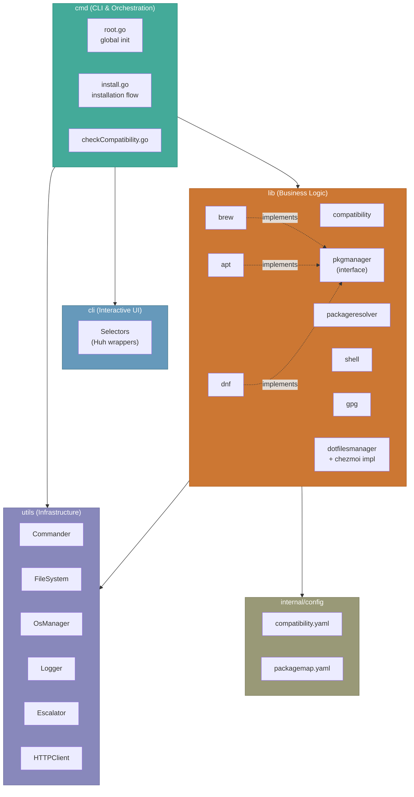

# Installer Architecture

## Overview

The installer is a Go CLI application structured in four layers: **cmd** (CLI entry points and orchestration), **lib** (business logic organized by domain area), **cli** (interactive UI components), and **utils** (shared infrastructure). Dependencies flow inward — cmd depends on lib and utils, lib depends on utils, and utils depends on nothing internal. All external interactions are behind interfaces for testability.

## Design Principles

- **Interface-driven**: Every interaction with the outside world (filesystem, command execution, HTTP, OS operations, package managers) is defined as an interface. Implementations are injected via constructors. This enables comprehensive unit testing with mocks — no real `apt-get install` calls in tests.
- **Layered with strict direction**: Dependencies flow `cmd → lib → utils`. The `lib` packages never import `cmd`. The `utils` packages never import `lib`. This keeps the business logic decoupled from CLI concerns.
- **One package per domain area**: Each area of concern (brew, apt, dnf, gpg, shell, compatibility, dotfiles management, package resolution) gets its own package under `lib/`. Packages communicate through interfaces, not concrete types.
- **Global state in cmd only**: The `cmd` layer holds global variables (`globalPackageManager`, `globalSysInfo`, `globalBrewPath`, `selectedGpgKey`) that thread state between installation steps. The `lib` layer is stateless — it receives everything it needs through constructor parameters and method arguments.

## Structure

### cmd — CLI Layer

- **Responsibility**: Define Cobra commands, parse flags, initialize global dependencies, orchestrate the [installation flow][installation]
- **Boundaries**: Imports from `lib`, `cli`, and `utils`. Never imported by other layers.
- **Key patterns**:
  - `root.go` initializes shared dependencies via `cobra.OnInitialize` (logger, commander, OS manager, compatibility config)
  - `install.go` orchestrates the sequential installation steps, managing global state between them
  - Each step calls into `lib` packages, passing pre-built dependencies

### lib — Business Logic Layer

Each package under `lib/` owns one domain area:

| Package | Responsibility | Key interfaces |
|---------|---------------|----------------|
| [`pkgmanager`][pkgmanager] | Package manager abstraction | `PackageManager` — install, uninstall, query packages |
| [`brew`][brew] | Homebrew implementation | Implements `PackageManager`; also `BrewInstaller` for installing Homebrew itself |
| [`apt`][apt] | APT implementation | Implements `PackageManager` |
| [`dnf`][dnf] | DNF implementation | Implements `PackageManager`; handles group/pattern types |
| [`compatibility`][compatibility] | System detection and prerequisite checking | `OSDetector`, `PrerequisiteChecker` |
| [`packageresolver`][packageresolver] | Abstract key → concrete package name resolution | `Resolver` (struct, not interface — internal use only) |
| [`shell`][shell] | Shell installation and default-setting | `ShellInstaller`, `ShellResolver`, `ShellChanger` |
| [`gpg`][gpg] | GPG client installation and key management | `GpgInstaller`, `GpgClient` |
| [`dotfilesmanager`][dotfilesmanager] | Chezmoi integration | `DotfilesManager` (composed of `DotfilesInstaller`, `DotfilesDataInitializer`, `DotfilesApplier`) |

**Dependency direction within lib**: Packages depend on `pkgmanager` (the interface), never on each other's concrete implementations. For example, `shell` accepts a `PackageManager` — it doesn't know whether it's brew or apt.

### cli — Interactive UI Layer

- **Responsibility**: Present interactive prompts to the user using [Huh][huh] (select menus, multi-select forms)
- **Boundaries**: Imported by `cmd` only. Knows nothing about `lib` internals — receives data as simple types.
- **Key components**:
  - `selector.go` — Generic single-select wrapper around Huh
  - `multiselect_selector.go` — Generic multi-select wrapper
  - `prerequisite_selector.go` — Prerequisite selection form
  - `gpg_selector.go` — GPG key selection form

### utils — Infrastructure Layer

Shared utilities that all other layers depend on:

| Package/File | Responsibility |
|-------------|----------------|
| `commander.go` | Command execution with functional options (`WithCaptureOutput`, `WithEnv`, `WithInput`, etc.) |
| `filesystem.go` | File and directory operations (`PathExists`, `ReadFile`, `WriteFile`, `CreateDirectory`) |
| `program_query.go` | Check if programs exist on PATH (wraps `exec.LookPath`) |
| `display_mode.go` | [Display mode][domain-display-modes] enum and behavior |
| `logger/` | Logging with hierarchical progress tracking (spinners, timing, nesting) |
| `osmanager/` | OS-level operations — user management, `/etc/shells`, `/etc/passwd`, environment |
| `privilege/` | Privilege escalation — detects and uses `sudo` or `doas` |
| `httpclient/` | HTTP client interface |
| `files/` | File utility helpers |
| `collections/` | Generic collection utilities |

### internal/config — Embedded Configuration

- **Responsibility**: Store static YAML config files ([`compatibility.yaml`][compatibility-yaml], [`packagemap.yaml`][packagemap-yaml]) embedded into the binary via `go:embed`
- **Boundaries**: Read-only. Loaded by `lib/compatibility` and `lib/packageresolver` through viper.

## Communication Patterns

### Constructor injection

All `lib` packages receive their dependencies through constructors. No package reaches into global state.

```
cmd creates:  Logger, Commander, FileSystem, OsManager, PackageManager
cmd passes to: brew.NewBrewInstaller(logger, commander, osManager, ...)
               shell.NewDefaultShellInstaller(shellName, resolver, pkgManager, ...)
               chezmoi.TryStandardChezmoiManager(logger, fs, osManager, commander, pkgManager, ...)
```

### Global state threading (cmd layer only)

The installation steps in `cmd/install.go` are sequential, and later steps need results from earlier ones. This is managed through package-level variables in `cmd`:

- `globalPackageManager` — set after Homebrew installation, used by all subsequent package operations
- `globalBrewPath` — set after Homebrew installation, used for shell resolution
- `globalSysInfo` — set after compatibility check, used for package manager creation
- `selectedGpgKey` — set after GPG setup, used during chezmoi data initialization

### Interface-based polymorphism

Package managers are the clearest example: `brew`, `apt`, and `dnf` all implement `pkgmanager.PackageManager`. The install command creates the appropriate implementation based on the detected system, then passes it to any code that needs to install packages. The consuming code never knows which manager it's using.

## Key Design Decisions

| Decision | Choice | Rationale |
|----------|--------|-----------|
| Interfaces for all external interactions | `Commander`, `FileSystem`, `OsManager`, `PackageManager`, `HTTPClient` | Enables unit testing with mockery-generated mocks. No real system calls in tests. |
| Functional options for Commander | `WithCaptureOutput()`, `WithEnv()`, etc. | Command execution has many optional behaviors (capture output, set env, provide stdin, set timeout). Functional options keep the API clean without explosion of method signatures. |
| Separate `pkgmanager` interface package | Interface in `pkgmanager/`, implementations in `brew/`, `apt/`, `dnf/` | Prevents import cycles. Any package can depend on the interface without pulling in specific implementations. |
| Composed `DotfilesManager` interface | Split into `Installer`, `DataInitializer`, `Applier` | Each phase of dotfiles management has a distinct concern. The composed interface is available when you need the full lifecycle, but individual interfaces work when you only need one phase. |
| Global state in cmd, not lib | `globalPackageManager`, `globalSysInfo`, etc. in `cmd/install.go` | Keeps `lib` packages stateless and testable. The orchestration complexity lives in one place (the install command) rather than scattered across packages. |
| Embedded YAML configs | `go:embed` in `internal/config/` | Single binary distribution. No config files to ship or lose. Overridable via flags for testing and customization. |
| Mockery for mock generation | `.mockery.yml` config, generated `*_mock.go` files | Consistent mock generation from interface definitions. Mocks stay in sync with interfaces automatically. |

## Diagram



## Constraints

- **Single binary**: The installer must be distributable as a single binary with no external config files. This drives the `go:embed` pattern for YAML configs.
- **Cross-platform**: Must build for Linux (amd64, arm64) and macOS (amd64, arm64). Platform-specific logic lives in `lib` packages and `utils/osmanager`, not in `cmd`.
- **No daemon**: The installer runs once and exits. No persistent state between runs (except what it writes to the filesystem). This means every run is a fresh start — no state recovery or resumption.
- **Privilege boundaries**: The installer itself runs as a regular user. Privileged operations (package installation, shell registration) use explicit privilege escalation via `sudo`/`doas`. The escalator detects which tool is available.

[installation]: processes/installation.md
[domain-display-modes]: domain.md#display-modes
[compatibility-yaml]: ../installer/internal/config/compatibility.yaml
[packagemap-yaml]: ../installer/internal/config/packagemap.yaml
[huh]: https://github.com/charmbracelet/huh
[pkgmanager]: ../installer/lib/pkgmanager
[brew]: ../installer/lib/brew
[apt]: ../installer/lib/apt
[dnf]: ../installer/lib/dnf
[compatibility]: ../installer/lib/compatibility
[packageresolver]: ../installer/lib/packageresolver
[shell]: ../installer/lib/shell
[gpg]: ../installer/lib/gpg
[dotfilesmanager]: ../installer/lib/dotfilesmanager
