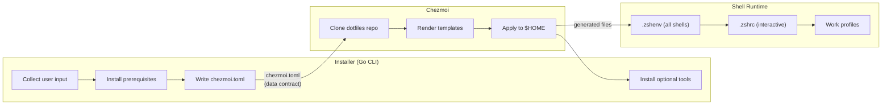

# Project Architecture

## Overview

The project has three major parts that interact through a clear data contract: a **Go installer** that bootstraps a new machine and produces configuration, **chezmoi templates** that consume that configuration to generate dotfiles, and the **resulting shell environment** that loads the generated files at runtime. The installer writes, templates read, the shell executes.

## Design Principles

- **Write once, consume everywhere**: The installer is the single source of truth for user configuration. It writes [chezmoi data][domain-data-schema] once; all templates read from it. This avoids drift between what the installer collected and what templates expect.
- **Progressive enhancement**: Each part of the system degrades gracefully. Shell startup skips unavailable tools rather than failing. The installer falls back from package managers to manual installation. Templates use conditionals to omit features that aren't configured.
- **Separation of concerns by lifecycle**: The installer runs once (at setup time), chezmoi applies periodically (when dotfiles change), and shell config runs every session. Each part only does work appropriate to its lifecycle.

## Structure

### Installer (`installer/`)

- **Responsibility**: Bootstrap a new machine — install prerequisites, configure the shell, set up GPG, collect user input, write chezmoi configuration, clone and apply dotfiles
- **Boundaries**: Produces `~/.config/chezmoi/chezmoi.toml` as its primary output. Does not manage dotfile content — that's chezmoi's job. Does not define shell behavior — that's the templates' job.
- **Dependencies**: System package managers (apt, dnf, brew), Git, network access, `gpg`
- **Internal architecture**: See [installer architecture][arch-installer]

### Chezmoi Templates (`dot_*`, `private_dot_*`, `*.tmpl`)

- **Responsibility**: Define what dotfiles look like on the target machine. Templates use chezmoi data to conditionally include or exclude configuration blocks (e.g., work environment, OS-specific paths).
- **Boundaries**: Reads chezmoi data (`~/.config/chezmoi/chezmoi.toml`). Writes to the home directory via `chezmoi apply`. Never modifies its own source or the chezmoi config.
- **Dependencies**: Chezmoi binary, chezmoi data (written by the installer)

### Shell Configuration (`dot_zshenv.tmpl`, `dot_zshrc.tmpl`, `private_dot_work/`)

- **Responsibility**: Configure the runtime shell environment — PATH, tool integrations, plugins, [work environment][domain-work-env] loading
- **Boundaries**: These are chezmoi templates that produce shell files. At runtime, the generated files are plain shell scripts with no chezmoi dependency.
- **Dependencies**: Generated by chezmoi from templates. At runtime, depends on installed tools (Homebrew, pyenv, sheldon, fzf, etc.)

### Embedded Configuration (`installer/internal/config/`)

- **Responsibility**: Store static configuration that the installer needs — supported platforms ([`compatibility.yaml`][compatibility-yaml]), package name mappings ([`packagemap.yaml`][packagemap-yaml]), and optional tool definitions ([`tools.yaml`][tools-yaml])
- **Boundaries**: Embedded into the Go binary at compile time via `go:embed`. Read-only at runtime. Overridable via CLI flags for testing.
- **Dependencies**: None — these are self-contained data files

## Communication Patterns

### Installer → Chezmoi (data contract)

The installer writes a TOML config file at `~/.config/chezmoi/chezmoi.toml` containing three [data namespaces][domain-data-schema]: `personal`, `system`, and `gpg`. Templates access these via `.personal.*`, `.system.*`, `.gpg.*`. This file is the sole interface between the installer and the template system.

**Why TOML**: Chezmoi natively supports TOML config files. Viper (used by the installer) can write TOML. No translation layer needed.

### Chezmoi → Home Directory (file generation)

`chezmoi init --apply` clones the source repo and renders templates into the home directory. The template language is Go's `text/template` with chezmoi extensions. Conditional blocks use chezmoi data and built-in variables (`.chezmoi.os`, `.chezmoi.arch`, `.chezmoi.group`).

### Shell Files → Runtime (sourcing chain)

Generated shell files execute in Zsh's standard sourcing order: `.zshenv` (all shells) → `.zshrc` (interactive only). Within each file, conditional sourcing loads optional components ([work profiles][domain-work-env], [deferred Homebrew][domain-deferred-brew], tool integrations). See the [shell startup process][shell-startup] for the full flow.

## Key Design Decisions

| Decision | Choice | Rationale |
|----------|--------|-----------|
| Installer in Go | Rewrite from Bash to Go | Testability, type safety, cross-compilation via goreleaser. Bash installer was fragile and hard to maintain. |
| Interface-based DI in installer | All external interactions behind interfaces | Every dependency (filesystem, commander, OS manager, package managers) is injectable and mockable. Enables unit testing without real system calls. |
| Embedded config files | `go:embed` for YAML configs | Single binary distribution — no need to ship config files alongside the binary. Overridable for testing. |
| Chezmoi as dotfiles manager | Not bare git, stow, or yadm | Templates with conditional logic, mature tooling, good cross-platform support. The two-tier work environment model relies on chezmoi's template system. |
| Sheldon for Zsh plugins | Not oh-my-zsh framework | oh-my-zsh is used only for vendored function/plugin snippets (loaded as local files), not as a runtime framework. Sheldon is faster and more composable. |
| Deferred Homebrew loading | Split across `.zshenv` / `.zshrc` | Homebrew's `shellenv` eval is expensive (~50ms). Deferring it on macOS keeps non-interactive shells fast while still having brew available for interactive use. |
| Fresh clone on every apply | Delete and re-clone `~/.local/share/chezmoi` | Avoids merge conflicts and stale state. The installer always applies the latest from the configured branch. |

## Diagram

[domain-data-schema]: domain.md#chezmoi-data-schema
[domain-work-env]: domain.md#work-environment
[domain-deferred-brew]: domain.md#deferred-homebrew-loading
[arch-installer]: architecture-installer.md
[compatibility-yaml]: ../installer/internal/config/compatibility.yaml
[packagemap-yaml]: ../installer/internal/config/packagemap.yaml
[tools-yaml]: ../installer/internal/config/tools.yaml
[shell-startup]: processes/shell-startup.md
