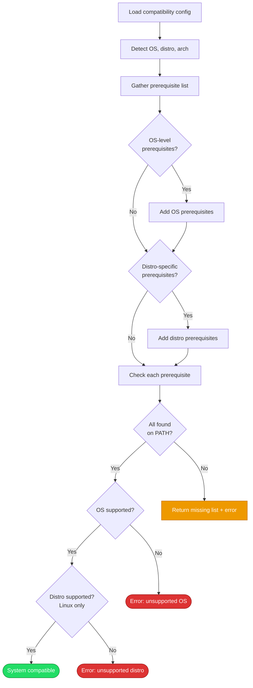

# Compatibility Checking

## Overview

Verifies that the current system can run the dotfiles setup: detects the OS and distribution, checks that required tools are installed, and validates that the platform is supported. This is the first gate in the [installation process][installation].

## Trigger

Either:
- The user runs `dotfiles-installer install` (automatically as step 1)
- The user runs `dotfiles-installer check-compatibility` (standalone check)

## Actors

- **OS detector**: Identifies the operating system, distribution, and architecture
- **Prerequisite checker**: Tests whether each required tool is present on the system PATH
- **[Compatibility config][compatibility-yaml]**: Declares supported platforms and their prerequisites

## Diagram

## Flow

### Happy Path

1. **Load config** — Read [`compatibility.yaml`][compatibility-yaml] (embedded in the binary or overridden via `--compat-config` flag). Contains supported OS/distro declarations and prerequisite lists.
2. **Detect system** — Identify OS (`runtime.GOOS`), architecture (`runtime.GOARCH`), and distribution:
   - **Linux**: Fallback chain — `/etc/os-release` → `/etc/lsb-release` → known distro files → `uname -s` → "unknown"
   - **macOS**: Distro hardcoded to `"mac"`
3. **Gather prerequisites** — Merge OS-level prerequisites with distro-specific prerequisites into a single list
4. **Check each prerequisite** — For each entry, test whether its command exists on the system PATH via `exec.LookPath`. Classify into Available and Missing lists.
5. **Validate platform support** — Confirm the OS is listed as `supported: true` in the config. For Linux, also confirm the distro is supported.

Result: A `SystemInfo` struct containing OS name, distro name, architecture, and prerequisite status (available, missing, details).

**Prerequisites checked per platform:**

| Platform | Prerequisites |
|----------|--------------|
| macOS | `xcode-select`, `bash`, `git` |
| Ubuntu / Debian | `gcc` (build-essential), `ps` (procps), `curl`, `file`, `git` |
| Fedora / CentOS / RHEL | `gcc` (build-essential), `ps` (procps), `curl`, `file`, `git` |

### Failure Scenarios

#### Missing prerequisites

- **Trigger**: One or more required commands not found on PATH
- **At step**: 4
- **Handling**: Returns the `SystemInfo` with a populated Missing list alongside an error. The caller (install command) decides whether to attempt [prerequisite installation][prereq-install].
- **User impact**: In standalone mode, the user sees the missing items with install hints. In install mode, the installer may offer to install them.

#### Unsupported OS or distro

- **Trigger**: The detected OS or Linux distribution isn't declared as `supported: true` in the config
- **At step**: 5
- **Handling**: Returns an error naming the unsupported platform
- **User impact**: The installer exits. The user must either add support to the config or set up the system manually.

#### System detection fails

- **Trigger**: `runtime.GOOS` returns an unexpected value, or Linux distro detection exhausts all fallback methods
- **At step**: 2
- **Handling**: Returns an error immediately
- **User impact**: The installer cannot proceed. This typically means the OS is not Linux or macOS.

## State Changes

- No state changes — this is a read-only detection process.
- `globalSysInfo` is populated in the install command's scope for use by subsequent steps.

## Dependencies

- Embedded [`compatibility.yaml`][compatibility-yaml]
- `/etc/os-release`, `/etc/lsb-release` (Linux distro detection)
- `exec.LookPath` for each prerequisite command
- `runtime.GOOS` and `runtime.GOARCH`

[compatibility-yaml]: ../../installer/internal/config/compatibility.yaml
[installation]: installation.md
[prereq-install]: prerequisite-installation.md
