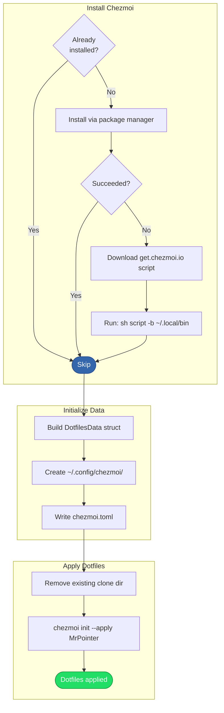

# Dotfiles Setup

## Overview

Installs chezmoi, prepares the [chezmoi data][domain-data-schema] configuration from all collected input, clones the dotfiles repository, and applies the dotfiles to the home directory. This is the final step of the [installation process][installation] — everything before this was preparation for this moment.

## Trigger

Called during the [installation process][installation] after shell and GPG setup are complete.

## Actors

- **Chezmoi manager**: Orchestrates installation, data initialization, and application
- **Package manager**: Installs chezmoi (primary method)
- **HTTP client**: Downloads the chezmoi install script (fallback method)
- **Chezmoi binary**: Clones the repo and applies dotfiles
- **Git**: Used by chezmoi under the hood for repository cloning

## Diagram

## Flow

### Step 1: Install Chezmoi

1. **Check if installed** — Ask the package manager if chezmoi is already present
2. **Try package manager** — Install `chezmoi` with version constraint `>= 2.60.0`
3. **Fallback to manual install** — If the package manager fails, download the install script from `get.chezmoi.io` and run `sh script -b ~/.local/bin`

### Step 2: Initialize Data

4. **Build data struct** — Assemble `DotfilesData` from all collected input:

   | Field | Source |
   |-------|--------|
   | `Email`, `FirstName`, `LastName` | Hardcoded (personal info) |
   | `Shell` | `--shell` flag (default: `zsh`) |
   | `GpgSigningKey` | Selected/created during [GPG setup][gpg-setup] |
   | `WorkEnv`, `WorkName`, `WorkEmail` | `--work-env`, `--work-name`, `--work-email` flags |
   | `GenericWorkProfile` | Computed: `~/.work/profile` (if work env) |
   | `SpecificWorkProfile` | Computed: `~/.work/{work_name}/profile` (if work env) |

5. **Create config directory** — Ensure `~/.config/chezmoi/` exists
6. **Write config file** — Map the data struct to chezmoi's [data schema][domain-data-schema] and write `~/.config/chezmoi/chezmoi.toml`:
   - `data.personal.email`, `data.personal.full_name`
   - `data.personal.work_env`, `data.personal.work_name`, `data.personal.work_email` (if work env)
   - `data.gpg.signing_key` (if GPG key selected)
   - `data.system.shell`
   - `data.system.work_generic_dotfiles_profile`, `data.system.work_specific_dotfiles_profile` (if work env)

### Step 3: Apply Dotfiles

7. **Remove existing clone** — Delete `~/.local/share/chezmoi` unconditionally (ensures a fresh clone)
8. **Run chezmoi** — Execute `chezmoi init --apply MrPointer` with flags:
   - `--source ~/.local/share/chezmoi`
   - `--config ~/.config/chezmoi/chezmoi.toml`
   - `--ssh` (if `--git-clone-protocol=ssh`)
   - `--branch {branch}` (if `--git-branch` specified)

   Chezmoi clones the dotfiles repo from GitHub, reads the config file for template data, renders all templates, and copies managed files to `$HOME`.

Result: All dotfiles are applied — shell configs, git config, work profiles, SSH config, and everything else managed by chezmoi.

### Failure Scenarios

#### Both installation methods fail

- **Trigger**: Package manager can't install chezmoi AND the `get.chezmoi.io` download/execution fails
- **At step**: 1-3
- **Handling**: Error propagated, installer exits
- **User impact**: Must install chezmoi manually

#### Config directory creation fails

- **Trigger**: Filesystem permission issue
- **At step**: 5
- **Handling**: Error propagated, installer exits
- **User impact**: Must create `~/.config/chezmoi/` manually and re-run

#### Config file write fails

- **Trigger**: Filesystem error or viper serialization issue
- **At step**: 6
- **Handling**: Error propagated, installer exits
- **User impact**: Must create the chezmoi config manually

#### Clone directory removal fails

- **Trigger**: Filesystem permission issue or locked files
- **At step**: 7
- **Handling**: Error propagated, installer exits
- **User impact**: Must remove `~/.local/share/chezmoi` manually and re-run

#### `chezmoi init --apply` fails

- **Trigger**: Git clone fails (network, auth), template rendering error (missing data key), or file permission issue during apply
- **At step**: 8
- **Handling**: Installer logs chezmoi's stderr and exits
- **User impact**: Must fix the issue (network, template, permissions) and run `chezmoi init --apply` manually

## State Changes

- **Chezmoi binary**: Installed (via package manager or `~/.local/bin/chezmoi`)
- **`~/.config/chezmoi/chezmoi.toml`**: Created with all template data
- **`~/.local/share/chezmoi/`**: Deleted and re-cloned from GitHub
- **Home directory**: All managed dotfiles applied (shell configs, git config, work profiles, SSH config, etc.)

## Dependencies

- Package manager (brew, apt, or dnf) for chezmoi installation
- `get.chezmoi.io` (fallback installer, requires HTTP access)
- Git (used by chezmoi for repository cloning)
- GitHub access (to clone `MrPointer/dotfiles`)
- Network access for both package installation and repo cloning

[installation]: installation.md
[gpg-setup]: gpg-setup.md
[domain-data-schema]: ../domain.md#chezmoi-data-schema
