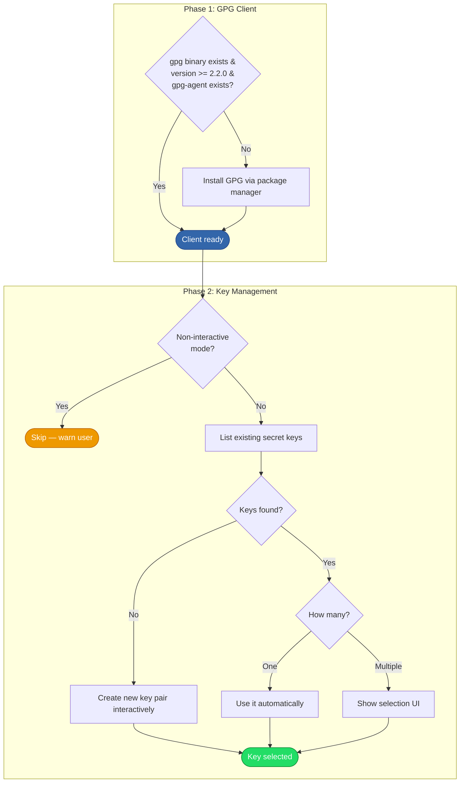

# GPG Setup

## Overview

Ensures a GPG client is installed and sets up a signing key for the user. Either creates a new key pair interactively or lets the user select from existing keys. The selected key is stored for use in [chezmoi data initialization][dotfiles-setup]. Skipped entirely in non-interactive mode.

## Trigger

Called during the [installation process][installation] after the shell is set up.

## Actors

- **GPG installer**: Checks for and installs the GPG client
- **GPG client**: Interfaces with the `gpg` binary for key listing and creation
- **User**: Selects an existing key or provides input for key creation (interactive only)
- **Package manager**: Installs the GPG package if needed

## Diagram

## Flow

### Phase 1: GPG Client Installation

1. **Check availability** — Three conditions must all pass:
   - `gpg` binary exists on PATH
   - `gpg --version` reports version >= 2.2.0
   - `gpg-agent` binary exists on PATH
2. **Install if needed** — If any check fails, install the `gpg` package via the active package manager

### Phase 2: Key Management

3. **Non-interactive guard** — If running in non-interactive mode, log a warning and skip key setup entirely. The user must set up keys manually afterward.
4. **List existing keys** — Run `gpg --list-secret-keys --keyid-format LONG` and parse output for key IDs (extract the ID after `/` on `sec` lines)
5. **Create or select**:
   - **No keys exist**: Run `gpg --gen-key --pinentry-mode loopback --default-new-key-algo nistp256` interactively. The user sees GPG's prompts directly. Extract the new key ID from the output using multiple fallback patterns.
   - **One key exists**: Use it automatically without prompting
   - **Multiple keys exist**: Show a Huh selection form listing all key IDs

Result: A GPG signing key ID is stored in `selectedGpgKey` for use by the [dotfiles setup process][dotfiles-setup].

### Failure Scenarios

#### GPG client installation fails

- **Trigger**: Package manager error
- **At step**: 2
- **Handling**: Error propagated, installer exits
- **User impact**: Must install GPG manually (`gnupg2` on apt/dnf, `gnupg` on brew)

#### TTY detection fails during key creation

- **Trigger**: No usable TTY found (no `GPG_TTY`, `tty` command fails, `/dev/tty` doesn't exist)
- **At step**: 5 (create path)
- **Handling**: Error propagated, installer exits
- **User impact**: Must create a GPG key manually. This typically only happens in non-standard environments.

#### Key ID extraction fails

- **Trigger**: GPG output format changed or none of the extraction patterns match
- **At step**: 5 (create path)
- **Handling**: Error reported — "could not find key ID in GPG output"
- **User impact**: Key was likely created but the installer couldn't identify it. Run `gpg --list-secret-keys` to find the key ID and configure chezmoi data manually.

#### User cancels key selection

- **Trigger**: User aborts the Huh selection form
- **At step**: 5 (select path)
- **Handling**: Error propagated, installer exits
- **User impact**: Must re-run the installer or configure the GPG key in chezmoi data manually

## State Changes

- **GPG package**: Installed if not already present
- **GPG keyring** (`~/.gnupg/`): New key pair created (if no keys existed)
- **`selectedGpgKey`**: Global variable set with the chosen key ID (consumed by [dotfiles setup][dotfiles-setup])

## Dependencies

- Package manager (brew, apt, or dnf) for GPG client installation
- `gpg` and `gpg-agent` binaries
- `pinentry` (implicit GPG dependency for passphrase entry during key creation)
- Terminal/TTY for interactive key creation and selection

[installation]: installation.md
[dotfiles-setup]: dotfiles-setup.md
[domain-data-schema]: ../domain.md#chezmoi-data-schema
