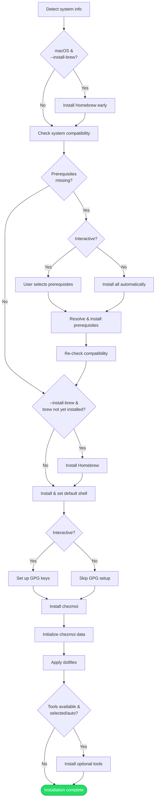

# Installation

## Overview

The installer bootstraps a new machine from scratch: it ensures system prerequisites are met, sets up the user's shell, configures GPG keys, and applies dotfiles through chezmoi. The process is designed to work on both macOS and Linux with minimal manual intervention.

## Trigger

User runs the `install` command (directly or via a release artifact).

## Actors

- **User**: Provides input (work environment, GPG key selection) in interactive mode
- **Installer CLI**: Orchestrates the entire flow
- **Package manager**: Installs prerequisites and tools (apt, dnf, or brew)
- **Chezmoi**: Applies dotfiles from the source repository to the home directory

## Diagram

## Flow

### Happy Path

1. **Detect basic system info** — OS name, architecture, distro (via OS detector)
2. **Install Homebrew early on macOS** — If `--install-brew` is set and the OS is macOS, install Homebrew *before* prerequisite checks. This solves the chicken-and-egg problem: Homebrew provides tools needed for prerequisite checks on macOS.
3. **[Check system compatibility][compat-check]** — Verify the system meets minimum requirements and identify missing prerequisites against [`compatibility.yaml`][compatibility-yaml]
4. **[Install missing prerequisites][prereq-install]** — Resolve [abstract package keys][domain-pkg-resolution] to concrete names, then install via the active package manager. In interactive mode, the user selects which prerequisites to install; in non-interactive mode, all are installed automatically.
5. **Re-check compatibility** — After installing prerequisites, verify the system passes all checks
6. **Install Homebrew on non-macOS** — If `--install-brew` is set and Homebrew wasn't installed in step 2
7. **[Install and configure shell][shell-setup]** — Install the target shell (default: zsh) using the [shell source strategy][domain-shell-source], then set it as the user's default shell
8. **[Set up GPG keys][gpg-setup]** — Check for existing GPG keys. If none exist, create a new key pair interactively. If keys exist, let the user select one. Skipped in non-interactive mode.
9. **[Set up dotfiles manager][dotfiles-setup]** — Install chezmoi if needed, initialize [chezmoi data][domain-data-schema] from collected input, then apply dotfiles
10. **[Install optional tools][tools-install]** — Load [tool definitions][domain-optional-tools] from `tools.yaml`, pre-filter against the active package manager, then either auto-install all (if `--install-tools`) or present an interactive multi-select. Individual failures are logged but never abort the install.

Result: Machine is fully configured with the user's dotfiles, shell, GPG setup, and selected optional tools.

### Failure Scenarios

Each sub-process has its own detailed failure scenarios. At the orchestration level:

- Any step failure in steps 1–9 causes the installer to exit non-zero — there is no rollback mechanism
- Step 10 (optional tools) is non-fatal: individual tool failures are logged but do not affect the exit code
- On macOS, Homebrew failure at step 2 blocks the entire flow (prerequisites depend on it)
- Steps are sequential: each depends on state set by previous steps (e.g., `selectedGpgKey` from step 8 feeds into step 9)

See the individual process docs for detailed failure scenarios and handling.

## State Changes

- **System packages**: Missing prerequisites installed (see [prerequisite installation][prereq-install])
- **Homebrew**: Installed and on PATH (if opted in)
- **Default shell**: Changed to the target shell (see [shell setup][shell-setup])
- **GPG keyring**: New key pair created or existing key selected (see [GPG setup][gpg-setup])
- **Chezmoi config**: `~/.config/chezmoi/chezmoi.toml` written with all data namespaces (see [dotfiles setup][dotfiles-setup])
- **Home directory**: Dotfiles applied — shell configs, git config, work profiles, etc.
- **Optional tools**: Selected CLI tools installed via the active package manager (if any were chosen)

## Sub-Processes

| Process | Description |
|---------|-------------|
| [Compatibility Checking][compat-check] | Detect OS/distro, verify prerequisites, validate platform support |
| [Prerequisite Installation][prereq-install] | Resolve and install missing prerequisites |
| [Package Resolution][pkg-resolution] | Translate abstract package keys to platform-specific names |
| [Shell Setup][shell-setup] | Install shell and set as default |
| [GPG Setup][gpg-setup] | Install GPG client, create or select signing key |
| [Dotfiles Setup][dotfiles-setup] | Install chezmoi, write config, clone repo, apply dotfiles |
| [Optional Tools Installation][tools-install] | Load tool definitions, pre-filter by platform, select and install optional CLI tools |

## Dependencies

- Internet access (for Homebrew installation, chezmoi installation, dotfiles repo clone)
- Sufficient privileges for package installation and shell changing (sudo)
- Git (listed as a prerequisite, installed automatically if missing)

[compatibility-yaml]: ../../installer/internal/config/compatibility.yaml
[packagemap-yaml]: ../../installer/internal/config/packagemap.yaml
[compat-check]: compatibility-checking.md
[prereq-install]: prerequisite-installation.md
[pkg-resolution]: package-resolution.md
[shell-setup]: shell-setup.md
[gpg-setup]: gpg-setup.md
[dotfiles-setup]: dotfiles-setup.md
[tools-install]: tools-installation.md
[domain-shell-source]: ../domain.md#shell-source-strategy
[domain-data-schema]: ../domain.md#chezmoi-data-schema
[domain-optional-tools]: ../domain.md#optional-tools
[domain-pkg-resolution]: ../domain.md#package-resolution
