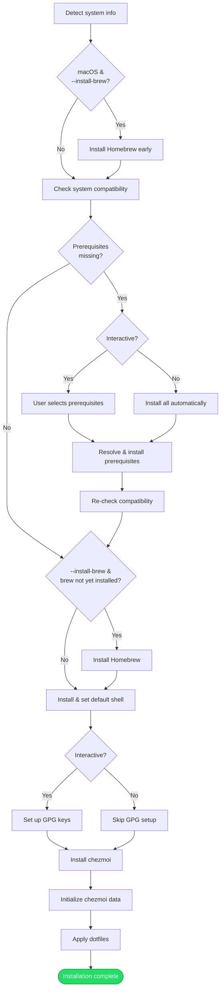

# Installation

## Overview

The installer bootstraps a new machine from scratch: it ensures system prerequisites are met, sets up the user's shell, configures GPG keys, and applies dotfiles through chezmoi. The process is designed to work on both macOS and Linux with minimal manual intervention.

## Trigger

User runs the `install` command (directly or via a release artifact).

## Actors

- **User**: Provides input (work environment, GPG key selection) in interactive mode
- **Installer CLI**: Orchestrates the entire flow
- **Package manager**: Installs prerequisites and tools (apt, dnf, or brew)
- **Chezmoi**: Applies dotfiles from the source repository to the home directory

## Diagram

## Flow

### Happy Path

1. **Detect basic system info** — OS name, architecture, distro (via OS detector)
2. **Install Homebrew early on macOS** — If `--install-brew` is set and the OS is macOS, install Homebrew *before* prerequisite checks. This solves the chicken-and-egg problem: Homebrew provides tools needed for prerequisite checks on macOS.
3. **Check system compatibility** — Verify the system meets minimum requirements and identify missing prerequisites against [`compatibility.yaml`][compatibility-yaml]
4. **Install missing prerequisites** — Resolve abstract package keys to concrete names (see [package resolution][pkg-resolution]), then install via the active package manager. In interactive mode, the user selects which prerequisites to install; in non-interactive mode, all are installed automatically.
5. **Re-check compatibility** — After installing prerequisites, verify the system passes all checks
6. **Install Homebrew on non-macOS** — If `--install-brew` is set and Homebrew wasn't installed in step 2
7. **Install and configure shell** — Install the target shell (default: zsh) using the [shell source strategy][domain-shell-source], then set it as the user's default shell
8. **Set up GPG keys** — Check for existing GPG keys. If none exist, create a new key pair interactively. If keys exist, let the user select one. Skipped in non-interactive mode.
9. **Set up dotfiles manager** — Install chezmoi if needed, initialize [chezmoi data][domain-data-schema] from collected input, then apply dotfiles

Result: Machine is fully configured with the user's dotfiles, shell, and GPG setup.

### Failure Scenarios

#### Compatibility check fails after prerequisite installation

- **Trigger**: A prerequisite could not be installed, or the system has a fundamental incompatibility
- **At step**: 5 (re-check compatibility)
- **Handling**: The installer logs a detailed error explaining what's still missing and exits non-zero
- **User impact**: Must resolve the remaining issues manually

#### Homebrew installation fails

- **Trigger**: Network issues, unsupported architecture, or permissions problem
- **At step**: 2 or 6
- **Handling**: Installer logs the error and exits. On macOS (step 2), this blocks the entire flow since brew is needed for prerequisites.
- **User impact**: Must install Homebrew manually or fix the underlying issue

#### Package resolution fails

- **Trigger**: A prerequisite's abstract key has no mapping for the active package manager or distro
- **At step**: 4
- **Handling**: Installer logs which package could not be resolved and exits
- **User impact**: Must install the package manually or add a mapping to [`packagemap.yaml`][packagemap-yaml]

#### Shell installation or default-setting fails

- **Trigger**: Package manager error, or insufficient privileges to modify `/etc/shells` and `chsh`
- **At step**: 7
- **Handling**: Installer uses privilege escalation (sudo) for shell registration. If that fails, logs the error and exits.
- **User impact**: Must set the default shell manually

#### GPG key creation fails (interactive)

- **Trigger**: GPG client not available, or key generation error
- **At step**: 8
- **Handling**: Installer attempts to install the GPG client first. If key creation still fails, logs the error and exits.
- **User impact**: Must create GPG keys manually; dotfiles will be applied without a signing key

#### Chezmoi apply fails

- **Trigger**: Template error, missing chezmoi data key, or file permission issue
- **At step**: 9
- **Handling**: Installer logs the chezmoi error output and exits
- **User impact**: Must fix the template or data issue and re-run

## State Changes

- **System packages**: Missing prerequisites installed
- **Homebrew**: Installed and on PATH (if opted in)
- **Default shell**: Changed to the target shell
- **GPG keyring**: New key pair created or existing key selected
- **Chezmoi config**: `~/.config/chezmoi/chezmoi.yaml` written with all data namespaces
- **Home directory**: Dotfiles applied — shell configs, git config, work profiles, etc.

## Dependencies

- Internet access (for Homebrew installation, chezmoi installation, dotfiles repo clone)
- Sufficient privileges for package installation and shell changing (sudo)
- Git (listed as a prerequisite, installed automatically if missing)

[compatibility-yaml]: ../../installer/internal/config/compatibility.yaml
[packagemap-yaml]: ../../installer/internal/config/packagemap.yaml
[pkg-resolution]: package-resolution.md
[domain-shell-source]: ../domain.md#shell-source-strategy
[domain-data-schema]: ../domain.md#chezmoi-data-schema
