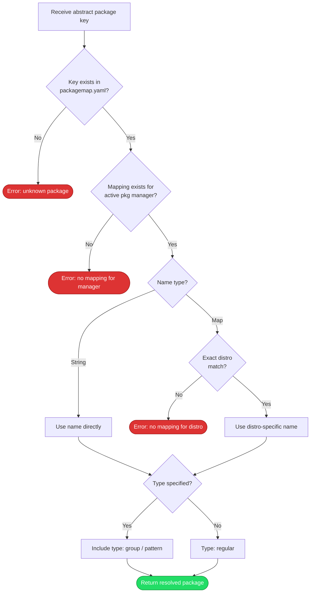

# Package Resolution

## Overview

Translates a platform-independent package name into a concrete, installable package for the current system. This allows prerequisite lists and compatibility checks to use abstract names while the installer handles platform-specific differences at install time.

## Trigger

The installer needs to install a package identified by an [abstract key][domain-pkg-resolution] (e.g., during prerequisite installation in the [installation process][installation]).

## Actors

- **Package resolver**: Looks up mappings and resolves names
- **Package manager**: Provides the manager type (apt, dnf, brew) used to select the right mapping
- **System info**: Provides the distro name used for distro-specific overrides

## Diagram

## Flow

### Happy Path

1. **Look up abstract key** — Find the entry in [`packagemap.yaml`][packagemap-yaml] for the requested package name (e.g., `build-essential`)
2. **Select manager mapping** — From that entry, find the sub-entry for the active package manager (e.g., `dnf`)
3. **Resolve package name** — Two cases:
   - Name is a string → use it directly (e.g., `apt: build-essential`)
   - Name is a map → look up the exact distro name (e.g., `fedora: development-tools`)
4. **Determine package type** — If the mapping specifies a `type` (e.g., `group`), include it in the resolved result. Otherwise, it's a regular package. See [package types][domain-pkg-types] for the full list.
5. **Return resolved package** — Name + type + any version constraints, ready for the package manager to install

Result: A concrete package name and type that the package manager can install directly.

### Failure Scenarios

#### No mapping for abstract key

- **Trigger**: The abstract key doesn't exist in [`packagemap.yaml`][packagemap-yaml]
- **At step**: 1
- **Handling**: Resolver returns an error indicating the package is unknown
- **User impact**: The package must be added to [`packagemap.yaml`][packagemap-yaml] or installed manually

#### No mapping for active package manager

- **Trigger**: The abstract key exists but has no entry for the current package manager (e.g., key has `apt` and `dnf` but not `brew`)
- **At step**: 2
- **Handling**: Resolver returns an error — no fallback to another manager
- **User impact**: A mapping for this manager must be added, or the package installed manually

#### Distro-specific name not found

- **Trigger**: The name is a distro map but the current distro isn't listed (e.g., map has `fedora` and `centos` but system is `rhel`)
- **At step**: 3
- **Handling**: Resolver returns an error. There is no fallback behavior — this is intentional to prevent installing the wrong package.
- **User impact**: A mapping for this distro must be added to [`packagemap.yaml`][packagemap-yaml]

## State Changes

- No state changes — resolution is a pure lookup. The actual installation happens in the calling process.

## Dependencies

- [`packagemap.yaml`][packagemap-yaml] must be loaded and accessible
- System info (distro name) must be detected before resolution
- A package manager must be active (determines which mapping branch to follow)

[packagemap-yaml]: ../../installer/internal/config/packagemap.yaml
[installation]: installation.md
[domain-pkg-resolution]: ../domain.md#package-resolution
[domain-pkg-types]: ../domain.md#package-resolution
