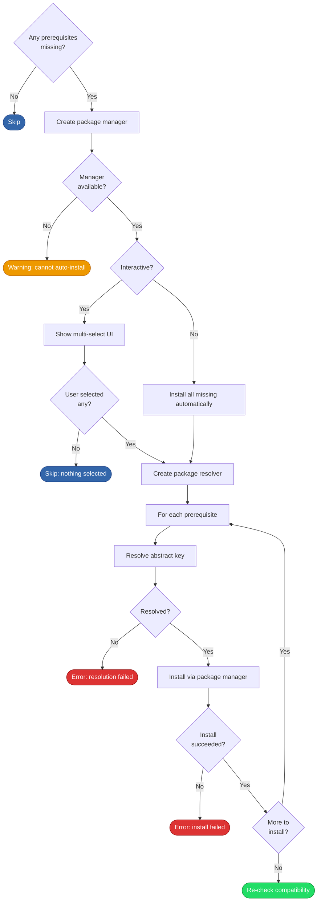

# Prerequisite Installation

## Overview

Installs missing system prerequisites identified by [compatibility checking][compat-check]. Resolves [abstract package keys][domain-pkg-resolution] to platform-specific names and installs them via the active package manager. In interactive mode, the user selects which prerequisites to install.

## Trigger

The [compatibility check][compat-check] returns one or more missing prerequisites during the [installation process][installation].

## Actors

- **User**: Selects which prerequisites to install (interactive mode only)
- **Package resolver**: Translates abstract keys to concrete package names (see [package resolution][pkg-resolution])
- **Package manager**: Installs the resolved packages (apt, dnf, or brew)
- **Privilege escalator**: Provides sudo/doas for package installation on Linux

## Diagram

## Flow

### Happy Path

1. **Guard** — If no prerequisites are missing, skip entirely
2. **Create package manager** — Use the global package manager if already set (e.g., Homebrew installed early on macOS), otherwise create a native one based on OS/distro (apt for Ubuntu/Debian, dnf for Fedora/CentOS/RHEL)
3. **Decide what to install**:
   - **Non-interactive** (`--non-interactive` or `--install-prerequisites`): install all missing prerequisites
   - **Interactive**: present a multi-select form (via Huh) showing each prerequisite with its description and install hint. User selects with space, confirms with enter.
4. **Create package resolver** — Load [`packagemap.yaml`][packagemap-yaml] mappings and create a resolver for the active package manager and system info
5. **Resolve and install each prerequisite** — For each selected prerequisite:
   - Resolve the abstract key to a concrete package name and type via the [package resolution process][pkg-resolution]
   - Install via the package manager (handles regular packages, groups, and patterns)
6. **Trigger re-check** — Return success to the caller, which re-runs compatibility checking to verify all prerequisites are now present

Result: Missing prerequisites installed. The caller re-checks compatibility to confirm.

### Failure Scenarios

#### No package manager available

- **Trigger**: System has no supported native package manager and Homebrew isn't installed
- **At step**: 2
- **Handling**: Logs a warning and returns without installing. Falls through to the compatibility error handler.
- **User impact**: Must install prerequisites manually using the install hints shown

#### User selects nothing (interactive)

- **Trigger**: User deselects all items in the multi-select form
- **At step**: 3
- **Handling**: Returns gracefully without installing anything
- **User impact**: Compatibility check will fail again, and the installer exits with hints

#### Package resolution fails

- **Trigger**: A prerequisite's abstract key has no mapping for the active manager or distro
- **At step**: 5
- **Handling**: Logs the failure and returns
- **User impact**: Must add the mapping to [`packagemap.yaml`][packagemap-yaml] or install the package manually

#### Package installation fails

- **Trigger**: Package manager returns an error (network issue, permission denied, package not found)
- **At step**: 5
- **Handling**: Logs the failure and returns
- **User impact**: Must resolve the package manager issue and retry

#### Re-check still fails

- **Trigger**: Some prerequisites couldn't be installed or the installed version doesn't satisfy the check
- **At step**: 6 (in the caller)
- **Handling**: The installer prints remaining missing items with install hints and exits
- **User impact**: Must resolve the remaining issues manually

## State Changes

- System packages installed via apt/dnf/brew
- No installer-specific state files written

## Dependencies

- A supported package manager (apt, dnf, or brew)
- [`packagemap.yaml`][packagemap-yaml] for name resolution
- Privilege escalation (sudo/doas) for apt/dnf installations
- Terminal/TTY for interactive prerequisite selection

[compat-check]: compatibility-checking.md
[installation]: installation.md
[pkg-resolution]: package-resolution.md
[packagemap-yaml]: ../../installer/internal/config/packagemap.yaml
[domain-pkg-resolution]: ../domain.md#package-resolution
