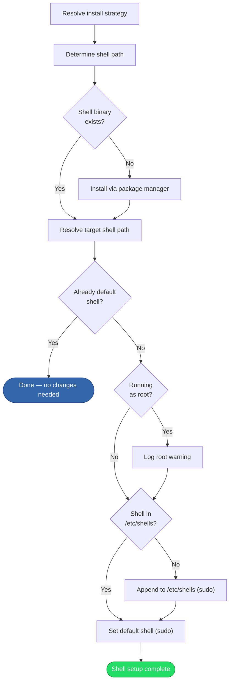

# Shell Setup

## Overview

Installs the target shell (default: zsh) if not already present and sets it as the user's default login shell. The [shell source strategy][domain-shell-source] determines where the shell binary comes from and which path is registered as the default.

## Trigger

Called during the [installation process][installation] after prerequisites are satisfied and Homebrew is set up.

## Actors

- **Shell resolver**: Determines the expected shell binary path based on the source strategy
- **Package manager**: Installs the shell if missing (brew, apt, or dnf)
- **Shell changer**: Registers the shell in `/etc/shells` and changes the user's default via `chsh`/`dscl`
- **Privilege escalator**: Provides sudo/doas for system modifications

## Diagram

## Flow

### Happy Path

1. **Resolve install strategy** — Based on the `--shell-source` flag, select the package manager and create a shell resolver:
   - `auto`: try brew first (if available), fall back to native package manager
   - `brew`: use Homebrew exclusively
   - `system`: use native package manager exclusively
2. **Check availability** — The resolver determines the expected binary path based on the strategy:
   | Source | Path resolution |
   |--------|----------------|
   | `brew` | `{brew_prefix}/bin/{shell}` |
   | `system` | First match in `/bin`, `/usr/bin`, `/usr/local/bin` |
   | `auto` | Brew path if it exists, otherwise system dirs |
3. **Install shell** — If the binary doesn't exist at the expected path, install it via the selected package manager
4. **Check if already default** — Read the current user's default shell:
   - **macOS**: `dscl . -read /Users/{username} UserShell`
   - **Linux**: Parse field 7 of the user's `/etc/passwd` entry
   - If already set to the target path, skip the remaining steps
5. **Ensure shell in `/etc/shells`** — Read `/etc/shells` and check if the target path is listed. If not, append it using `sudo tee -a /etc/shells`.
6. **Set as default** — Change the user's login shell:
   - **macOS**: `sudo dscl . -create /Users/{username} UserShell {path}`
   - **Linux**: `sudo usermod -s {path} {username}`

Result: The target shell is installed and set as the user's default login shell.

### Failure Scenarios

#### Invalid shell source

- **Trigger**: `--shell-source` is not `auto`, `brew`, or `system`
- **At step**: 1
- **Handling**: Returns an error immediately
- **User impact**: Must use a valid shell source value

#### Shell source requires unavailable manager

- **Trigger**: `--shell-source=brew` but Homebrew isn't installed, or `--shell-source=system` but no native manager exists
- **At step**: 1
- **Handling**: Returns a descriptive error
- **User impact**: Must install the required package manager or use a different source strategy

#### Package installation fails

- **Trigger**: Package manager error (network, permissions, package not found)
- **At step**: 3
- **Handling**: Error propagated, installer exits
- **User impact**: Must install the shell manually

#### Cannot modify `/etc/shells`

- **Trigger**: Privilege escalation fails (no sudo access, user cancels sudo prompt)
- **At step**: 5
- **Handling**: Error propagated, installer exits
- **User impact**: Must manually add the shell path to `/etc/shells`

#### Cannot change default shell

- **Trigger**: `dscl` or `usermod` command fails
- **At step**: 6
- **Handling**: Error propagated, installer exits
- **User impact**: Must run `chsh` or equivalent manually

## State Changes

- **Shell binary**: Installed if not already present
- **`/etc/shells`**: New entry appended if the shell path wasn't listed
- **Default shell**: Changed for the current user (Directory Services on macOS, `/etc/passwd` on Linux)

## Dependencies

- Package manager (brew, apt, or dnf) for shell installation
- `sudo`/`doas` for modifying `/etc/shells` and changing the default shell
- `dscl` (macOS) or `usermod` (Linux) for setting the default shell
- `/etc/passwd` (Linux) for reading the current default shell

[installation]: installation.md
[domain-shell-source]: ../domain.md#shell-source-strategy
