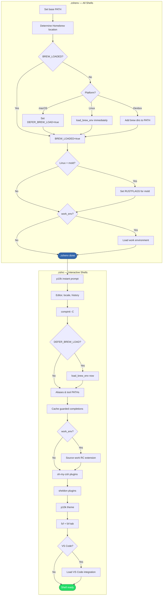

# Shell Startup

## Overview

Describes how the Zsh shell environment initializes, including Homebrew loading, PATH setup, guarded completion setup, work environment activation, and plugin loading. The startup is split across `.zshenv` (all shells) and `.zshrc` (interactive shells) with an emphasis on keeping non-interactive shell startup fast.

## Trigger

A new Zsh shell session starts — either interactive (terminal) or non-interactive (script execution, IDE subprocess).

## Actors

- **Zsh**: Executes `.zshenv` for all sessions, then `.zshrc` for interactive sessions
- **Chezmoi templates**: Generate the actual shell files from [`dot_zshenv.tmpl`][zshenv-tmpl] and [`dot_zshrc.tmpl`][zshrc-tmpl] using [chezmoi data][domain-data-schema]
- **Homebrew**: Provides the `shellenv` command that sets up PATH and environment
- **Sheldon**: Plugin manager that loads Zsh plugins in interactive sessions

## Diagram

## Flow

### `.zshenv` Phase (All Shells)

1. **Set base PATH** — Add `~/.local/bin`, `~/bin`, `/usr/local/bin` with duplicate removal
2. **Determine Homebrew location** — Based on OS and architecture:
   - Linux: `/home/linuxbrew/.linuxbrew`
   - macOS arm64: `/opt/homebrew`
   - macOS x86: `/usr/local`
3. **Handle Homebrew loading** — Platform-dependent behavior (only if `BREW_LOADED` is not already set). See [deferred Homebrew loading][domain-deferred-brew] for the concept. When Homebrew's `shellenv` is evaluated, `~/.local/bin` and `~/bin` are re-prepended so user-local defaults such as uv-managed `python`/`python3` symlinks take precedence over Homebrew binaries.
   - **macOS (non-devbox)**: Set `DEFER_BREW_LOAD=true` — postpone the expensive `shellenv` eval to `.zshrc`
   - **Linux**: Call `load_brew_env` immediately — PATH consistency is more important than startup speed
   - **Devbox**: Add brew directories to PATH directly — no `eval` needed
   - Set `BREW_LOADED=true` to prevent double-loading
4. **Set up Rust linker** — On Linux with mold available, configure `RUSTFLAGS` to use mold
5. **Load work environment** — If `personal.work_env` is true, see the [work environment loading process][work-env-loading]

### `.zshrc` Phase (Interactive Shells Only)

1. **Powerlevel10k instant prompt** — Load cached prompt for immediate visual feedback
2. **Set editor and locale** — `VISUAL`, `EDITOR`, `LANG`, `LC_ALL`
3. **Configure history** — History file, size, append mode
4. **Set up completions** — Configure fpath, add Homebrew's `share/zsh/site-functions` directory before `compinit`, then run `compinit -C` (cached).
5. **Complete deferred brew loading** — If `DEFER_BREW_LOAD` is `true`, call `load_brew_env` now
6. **Set up aliases** — Git, neovim, GPG unlock
7. **Add tool PATHs** — Cargo, Go, Ruby gems, clang-format, bun (conditional on tool availability)
8. **Cache completions** — Generate completion files for cargo, poetry, pip, pipx only if missing or older than 7 days. `pipx` completion generation requires both `pipx` and `register-python-argcomplete` to exist before invoking argcomplete.
9. **Source work RC extension** — If `personal.work_env` is true, source `WORK_ZSH_RC_EXTENSION` (see [work environment loading][work-env-loading])
10. **Load oh-my-zsh functions and plugins** — Vendored git functions, key-bindings, git, dotenv plugins
11. **Load sheldon plugins** — `eval "$(sheldon source)"` loads the plugin set defined in [`plugins.toml`][sheldon-plugins]
12. **Load Powerlevel10k theme** — Source `~/.p10k.zsh`
13. **Configure fzf and fzf-tab** — Fuzzy finder integration with completion system
14. **VS Code shell integration** — If running inside VS Code terminal, load VS Code's shell integration script

### Failure Scenarios

#### Homebrew binary not found

- **Trigger**: `BREW_BINARY` path doesn't exist (Homebrew not installed)
- **At step**: `.zshenv` step 3
- **Handling**: The `if [[ -f "$BREW_BINARY" ]]` guard skips all Homebrew setup silently
- **User impact**: No Homebrew-provided tools on PATH. Everything else works normally.

#### Work profile not readable

- **Trigger**: `work_env` is true but the profile file doesn't exist or isn't readable
- **At step**: `.zshenv` step 6
- **Handling**: The `[[ -r ... ]]` guard skips sourcing. Shell starts without work config.
- **User impact**: Work-specific environment variables and paths won't be set. Run the installer with `--work-env` to regenerate.

#### Optional Python tooling not installed

- **Trigger**: `uv`, `pip`, `poetry`, `pipx`, or `register-python-argcomplete` is not installed
- **At step**: `.zshrc` steps 4 and 8
- **Handling**: Guarded completion setup skips missing tools. Brew-installed uv/uvx completions are available only when Homebrew provides completion files on `fpath` and zsh's completion cache recognizes them.
- **User impact**: Shell startup succeeds. Missing tools simply do not provide completions or commands until the user installs or activates them.

#### Stale zsh completion cache after Homebrew uv installation

- **Trigger**: `uv` is installed by Homebrew outside the interactive `brew` wrapper path, but `compinit -C` reuses an older `~/.zcompdump`
- **At step**: `.zshrc` step 4
- **Handling**: The Homebrew completion directory remains on `fpath`, but zsh may not immediately discover new `_uv` or `_uvx` completion files until the cache is refreshed
- **User impact**: uv commands work if installed, but uv/uvx completions may appear only after normal completion cache refresh or manual cache invalidation

## State Changes

- **Environment variables**: PATH, BREW_HOME, BREW_LOADED, DEFER_BREW_LOAD, WORK_ENV_LOADED, and tool-specific vars
- **Shell functions**: `load_brew_env`, `brew` wrapper (invalidates completion cache on install/uninstall)
- **Completion system**: `compinit` initialized with cache, fpath populated

## Dependencies

- Chezmoi must have applied the dotfiles (`.zshenv` and `.zshrc` are generated from templates)
- [Chezmoi data][domain-data-schema] must be populated (templates reference `.personal.*`, `.system.*`, `.chezmoi.*`)

[zshenv-tmpl]: ../../dot_zshenv.tmpl
[zshrc-tmpl]: ../../dot_zshrc.tmpl
[sheldon-plugins]: ../../dot_config/sheldon/plugins.toml
[domain-data-schema]: ../domain.md#chezmoi-data-schema
[domain-deferred-brew]: ../domain.md#deferred-homebrew-loading
[work-env-loading]: work-environment-loading.md
