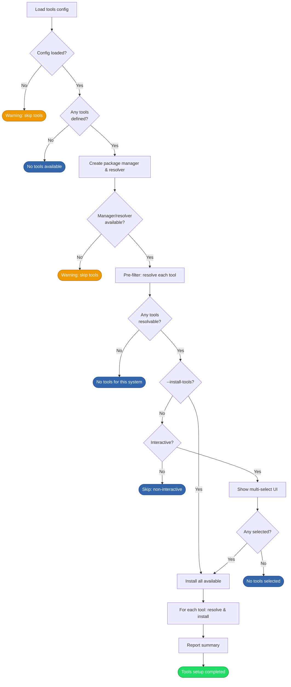

# Optional Tools Installation

## Overview

Installs optional CLI tools after dotfiles have been applied. Loads [tool definitions][domain-optional-tools] from [`tools.yaml`][tools-yaml], pre-filters them against the active package manager, and installs the user's selection. This step is entirely non-fatal — failures are logged but never abort the install.

## Trigger

The [dotfiles setup][dotfiles-setup] step completes successfully during the [installation process][installation].

## Actors

- **User**: Selects which tools to install (interactive mode only)
- **Tools loader**: Reads tool definitions from `tools.yaml` (embedded or overridden via `--tools-config`)
- **Package resolver**: Pre-filters tools and resolves abstract keys to concrete package names (see [package resolution][pkg-resolution])
- **Package manager**: Installs the resolved packages (apt, dnf, or brew)
- **Tool selector**: Presents the multi-select UI for tool selection (cli layer)

## Diagram

## Flow

### Happy Path

1. **Load tools configuration** — Load from `--tools-config` file if provided, otherwise from the embedded `tools.yaml`. Uses a fresh viper instance to avoid state pollution from other config loaders.
2. **Guard: tools defined** — If no tools are defined in the config, finish early.
3. **Create package manager and resolver** — Reuse the system's active package manager and create a resolver for the current platform.
4. **Pre-filter tools** — For each tool in the config, attempt to resolve it against the active package manager. Only tools with valid mappings in [`packagemap.yaml`][packagemap-yaml] are kept. Tools without mappings are silently dropped (e.g., `sheldon`, `eza`, `difftastic` are brew-only and won't appear on apt/dnf systems).
5. **Guard: resolvable tools** — If no tools survived pre-filtering, finish early.
6. **Determine which tools to install**:
   - **`--install-tools` flag**: Auto-install all available tools without prompting
   - **Interactive**: Show a multi-select UI (all tools unselected by default). User selects with space, confirms with enter.
   - **Non-interactive without `--install-tools`**: Skip entirely
7. **Install each tool** — For each selected tool, resolve and install via the package manager. Failures are logged per-tool but do not stop remaining installations.
8. **Report summary** — Log the count of successes and failures.

Result: Selected tools installed. Failures logged but install continues.

### Failure Scenarios

#### Config load failure

- **Trigger**: `--tools-config` file doesn't exist or embedded config is corrupted
- **At step**: 1
- **Handling**: Logs a warning and skips the entire tools step
- **User impact**: No tools installed; main installation unaffected

#### No package manager or resolver available

- **Trigger**: System has no supported package manager
- **At step**: 3
- **Handling**: Logs a warning and skips tools
- **User impact**: Must install tools manually

#### Tool selection cancelled

- **Trigger**: User cancels the multi-select UI (e.g., Ctrl+C in Huh)
- **At step**: 6
- **Handling**: Logs a warning and skips tools
- **User impact**: No tools installed; main installation unaffected

#### Individual tool installation fails

- **Trigger**: Package manager returns an error for a specific tool
- **At step**: 7
- **Handling**: Logs the failure, continues with remaining tools, reports in summary
- **User impact**: Failed tools must be installed manually; other tools are unaffected

## State Changes

- System packages installed via apt/dnf/brew for each selected tool
- No installer-specific state files written — tool selections are not persisted

## Dependencies

- A supported package manager (apt, dnf, or brew)
- [`tools.yaml`][tools-yaml] for tool definitions
- [`packagemap.yaml`][packagemap-yaml] for name resolution
- Privilege escalation (sudo/doas) for apt/dnf installations
- Terminal/TTY for interactive tool selection

[installation]: installation.md
[dotfiles-setup]: dotfiles-setup.md
[pkg-resolution]: package-resolution.md
[packagemap-yaml]: ../../installer/internal/config/packagemap.yaml
[tools-yaml]: ../../installer/internal/config/tools.yaml
[domain-optional-tools]: ../domain.md#optional-tools
