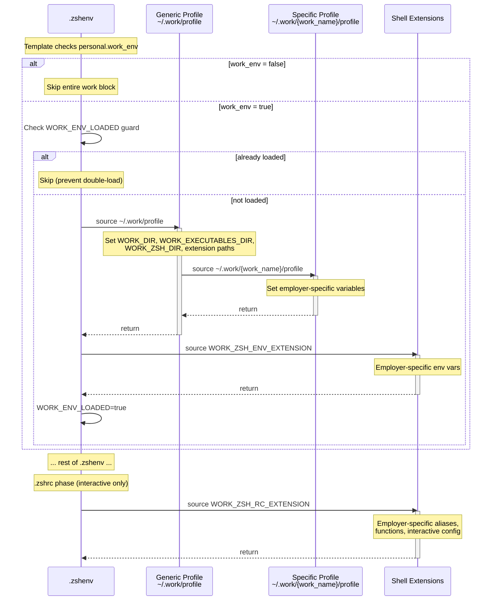

# Work Environment Loading

## Overview

Activates work-specific shell configuration during shell startup when the machine is configured as a work environment. Loads a two-tier profile system (generic work config, then employer-specific config) and injects shell extensions into both `.zshenv` and `.zshrc`.

## Trigger

A Zsh shell session starts on a machine where [chezmoi data][domain-data-schema] has `personal.work_env` set to `true`. This process is a sub-flow of [shell startup][shell-startup].

## Actors

- **Zsh**: Sources the profiles and extensions during startup
- **[Generic work profile][domain-work-env]** (`~/.work/profile`): Sets shared work variables and sources the specific profile
- **[Specific work profile][domain-work-env]** (`~/.work/{work_name}/profile`): Sets employer-specific variables
- **Shell extensions**: `.zshenv` and `.zshrc` fragments produced by both profile tiers

## Diagram

## Flow

### Happy Path

**During `.zshenv`** (all shells):

1. **Check activation** — Template checks `personal.work_env`. If false, the entire work block is skipped at template rendering time (not at runtime).
2. **Check guard** — If `WORK_ENV_LOADED` is set, skip to prevent double-loading (relevant when `.zshenv` is sourced multiple times)
3. **Source generic work profile** — [`~/.work/profile`][generic-profile-tmpl] runs, setting:
   - `WORK_DIR` (`~/.work`)
   - `WORK_EXECUTABLES_DIR` (`~/.work/bin`)
   - `WORK_ZSH_DIR`, `WORK_ZSH_RC_EXTENSION`, `WORK_ZSH_ENV_EXTENSION` (paths to shell extension files)
   - Then sources the specific work profile (`~/.work/{work_name}/profile`)
4. **Source work zshenv extension** — If `WORK_ZSH_ENV_EXTENSION` is set and the file is readable, source it. This adds employer-specific environment variables.
5. **Set guard** — `WORK_ENV_LOADED=true`

**During `.zshrc`** (interactive shells only):

6. **Source work zshrc extension** — If `WORK_ZSH_RC_EXTENSION` is set and the file is readable, source it. This adds employer-specific aliases, functions, or interactive config.

Result: Work-specific environment variables, paths, aliases, and functions are available in the shell session.

### Failure Scenarios

#### Work profiles not generated by chezmoi

- **Trigger**: Installer was not run with `--work-env`, or chezmoi hasn't been applied yet
- **At step**: 3
- **Handling**: The `[[ -r ... ]]` guard prevents sourcing a missing file. Shell starts without work config.
- **User impact**: No work environment active. Re-run the installer with `--work-env` and `chezmoi apply`.

#### Specific work profile missing

- **Trigger**: The generic profile tries to source `~/.work/{work_name}/profile` but the employer directory doesn't exist
- **At step**: 3 (inside generic profile)
- **Handling**: The `source` command fails. Depending on shell error handling, this may produce a warning.
- **User impact**: Generic work variables are set, but employer-specific config is missing. Ensure the employer directory exists in chezmoi source as `private_dot_work/private_{work_name}/`.

#### Shell extension files missing

- **Trigger**: The work zsh directory or extension files don't exist
- **At step**: 4 or 6
- **Handling**: The `[[ -n ... && -r ... ]]` guards skip sourcing silently
- **User impact**: No error, but work-specific shell extensions won't take effect

## State Changes

- **Environment variables**: `WORK_DIR`, `WORK_EXECUTABLES_DIR`, `WORK_ZSH_DIR`, `WORK_ZSH_RC_EXTENSION`, `WORK_ZSH_ENV_EXTENSION`, `WORK_ENV_LOADED`, plus any employer-specific variables
- **PATH**: May be extended with `WORK_EXECUTABLES_DIR` and employer-specific paths
- **Shell functions/aliases**: Employer-specific additions from zshrc extension

## Dependencies

- [Chezmoi data][domain-data-schema]: `personal.work_env`, `system.work_generic_dotfiles_profile`, `system.work_specific_dotfiles_profile` must be set
- Work profile files must exist at the expected paths (generated by chezmoi from [`private_dot_work/`][work-source-dir] templates)

[domain-data-schema]: ../domain.md#chezmoi-data-schema
[domain-work-env]: ../domain.md#work-environment
[shell-startup]: shell-startup.md
[generic-profile-tmpl]: ../../private_dot_work/profile.tmpl
[work-source-dir]: ../../private_dot_work
