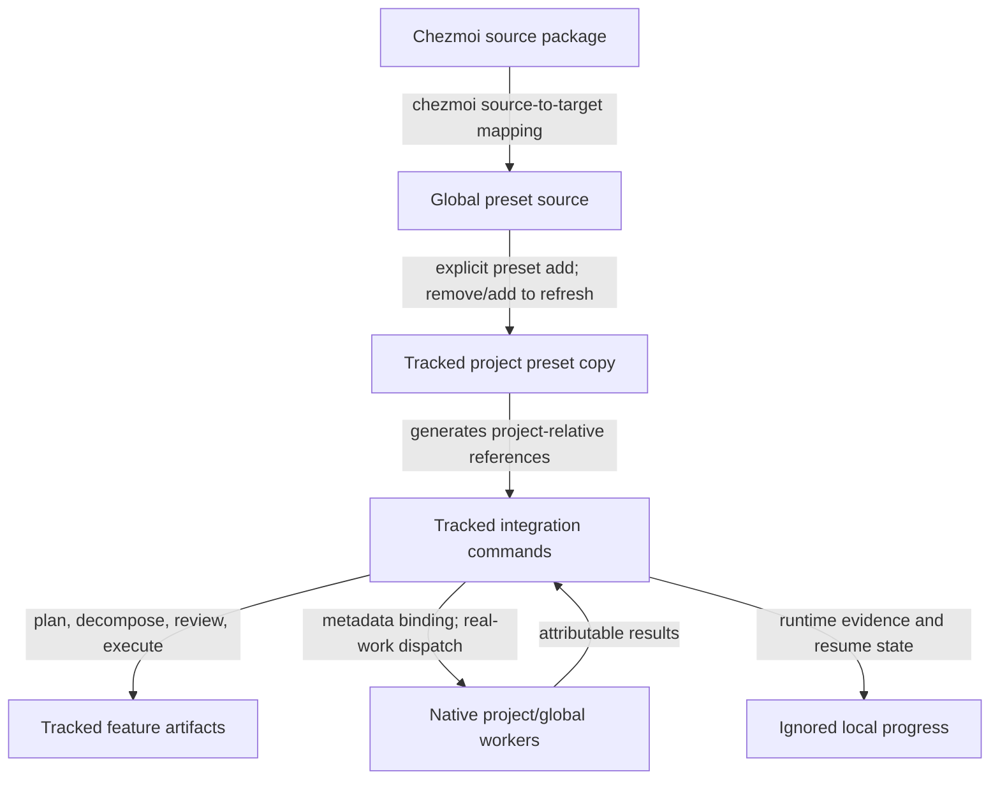

# Timor's Agentic Workflow Architecture

## Overview

`timors-agentic-workflow` is a project-installed Spec Kit preset that connects
grounded planning, reviewed execution decomposition, explicit human approval,
and delegated implementation through a versioned Markdown protocol. The preset
is provider-neutral: it defines command and artifact contracts, while the
active coding integration supplies concrete workers, models, skills, and
permissions. Its preset and protocol versions are both `0.1.0`, and it supports
Spec Kit `>=0.12.11,<0.13.0`.

The implemented package and installation behavior have been validated with
Spec Kit 0.12.11 and OpenCode 1.17.18. Runtime review and implementation have
not yet been exercised, so this document describes the implemented contracts
without claiming operational runtime support.

## Source, Installation, And Activation Boundaries

The editable chezmoi source is:

```text
private_dot_config/specify/presets/timors-agentic-workflow/
```

Chezmoi maps that source to the global preset source at:

```text
~/.config/specify/presets/timors-agentic-workflow/
```

The global source is a distribution source only. Its presence does not activate
the preset in any project, and chezmoi does not install or refresh project
copies automatically.

A project activates the preset explicitly with Spec Kit's development preset
installation. Installation copies the package into the tracked project path
`.specify/presets/timors-agentic-workflow/` and generates tracked command files
for the active coding integration. Generated commands refer to the installed,
project-relative preset path rather than the global source, leaving the project
independent of the dotfiles repository after installation.

For the verified OpenCode integration, those generated files are under
`.opencode/commands/`.

Spec Kit 0.12.11 has no in-place preset update command. A project receives
global source changes only after an explicit remove/add refresh. Its
`preset resolve` operation accepts template names only; command installation is
instead evidenced by the generated integration commands and their
project-relative installed-preset references.



## Versioned Command Boundary

Every command composed or replaced by the preset begins with a compatibility
preflight against the installed manifest and active `specify` version. A
missing, malformed, or out-of-range version fails closed before extension
hooks, prerequisite scripts, dispatch, or writes. This protects generated
commands that remain in a project after the CLI changes. The accepted
execution-plan protocol is likewise `0.1.0`; unsupported or malformed protocol
artifacts return to their owning generation command rather than being migrated
or inferred.

The preset deliberately uses different integration strategies by phase:

- `/speckit.specify` and `/speckit.clarify` remain upstream and continue to own
  requirements and product clarification.
- `/speckit.plan` and `plan-template` compose with upstream planning, retaining
  its design artifacts and adding verified grounding and integration context.
- `/speckit.tasks`, `tasks-template`, `/speckit.analyze`, and
  `/speckit.implement` replace their upstream surfaces because decomposition,
  independent review, approval, and delegated execution share a stronger
  protocol.
- Auxiliary templates provide the execution plan, cumulative review reports,
  aggregate analysis, and local progress ledger used by those replacements.

The installed package references are the executable policy boundary. Exact
headings, tables, identifiers, vocabularies, state transitions, and approval
combinations are normative in the [approved RFC][rfc] and [installed preset
references][preset-references], not in this architecture overview.

## Artifact Ownership

The protocol separates durable planning truth from local runtime evidence:

- `spec.md`, `plan.md`, and the normal design artifacts provide requirements,
  technical design, decisions, data models, contracts, and other planning
  inputs.
- `tasks.md` is the sole atomic task ledger. It owns task identity, task text,
  paths, story labels, task-local parallel hints, and completion checkboxes.
- `execution-plan.md` owns execution groups, the dependency graph and order,
  file ownership, cross-group contracts and data flow, semantic model tiers,
  required skills and capabilities, tests, acceptance criteria, and
  verification.
- `specs/<feature>/reviews/<role-id>.md` files are tracked cumulative sources of
  reviewer findings. Reruns append current-state rounds rather than replacing
  review history.
- `analysis.md` is the tracked aggregate of applicable review rounds and the
  location of the explicit human approval decision.
- `specs/<feature>/progress.md` is an ignored local ledger for concrete workers
  and models, workspaces, dispatch and test evidence, checkpoints, blockers,
  failures, integration state, and resume decisions. It does not duplicate
  atomic task completion truth.

This split keeps provider- and machine-specific details out of tracked planning
artifacts while preserving a reviewable decomposition and approval record.

## Planning And Review Flow

Task generation reads the specification, plan, and available design artifacts,
then creates `tasks.md` and `execution-plan.md` as one normalized pair. It
validates the pair before writing either artifact, so task descriptions and
checkboxes remain in the task ledger while execution policy remains in the
orchestration plan.

Before semantic review, analysis consumes the shared installed structural
validator. Structural failure blocks before reviewer dispatch or report writes.
After a successful preflight, the coordinator requires independent
fresh-context reviews from:

- Mid-tier `artifact-fidelity`, which traces the approved inputs into the
  planned work;
- Most capable `decomposition-design`, which judges execution feasibility and
  decomposition quality; and
- Mid-tier `plan-clarity`, which judges whether the handoff is unambiguous to a
  cold reader.

Projects may select additional project-owned reviewer packets. Each required
role writes to its cumulative report, and the coordinator preserves source
finding ownership while producing `analysis.md`. The coordinator validates and
aggregates reviewer output but does not perform a fallback semantic review.
Implementation remains blocked until the latest run is complete and the human
approval record authorizes it.

## Delegated Implementation Flow

Before mutation, implementation repeats the same installed structural
validation and checks report consistency and human authorization. It then
initializes or reconciles local progress and processes only groups made ready by
the approved dependency graph.

For each ready group, the coordinator binds the planned semantic tier, skills,
capabilities, and workspace requirements to an eligible native worker. It
constructs a deterministic packet from the canonical group record, group
details, owned task lines, and checkpointed prerequisite contract outputs. It
does not redesign groups or silently change their dependencies, ownership,
contracts, model tiers, tests, or acceptance criteria.

Policy-permitted parallel groups run in separate worktrees only after every
member of the dispatch set passes readiness and output/cache safety checks.
Completed results are integrated and verified, then retained in signed local
checkpoints before task checkboxes and group state become complete. Dependent
groups consume verified checkpoint outputs rather than uncommitted files. Once
all groups pass final verification, checkpoint history is materialized as one
aggregate dirty review diff while a local checkpoint reference preserves
recovery evidence.

These are implemented command contracts, but their runtime operation has not
yet been exercised through a normal feature.

## Provider-Neutral Runtime Binding

The preset neither provisions workers nor maps provider model IDs to semantic
tiers. Native project or global worker definitions own concrete models, skills,
permissions, invokability, fresh-context support, and workspace targeting;
project-local eligible definitions take precedence. The tracked plan therefore
remains portable across coding integrations, while concrete binding and
dispatch evidence stays in ignored progress or transient runtime state.

Suitability checks inspect runtime metadata and configuration only. Preflight
does not invoke a worker, calibration task, probe, canary, or sacrificial call.
The first worker invocation carries the real assigned review or implementation
work. Missing evidence for tier, concrete model, skills, permissions,
invokability, fresh context or attribution, workspace targeting, dispatch, or
result identity blocks the applicable role or group.

## Failure And Recovery Boundaries

The protocol fails closed at ownership boundaries rather than repairing state
in a later phase:

- Unsupported, missing, or malformed task/execution artifacts are regenerated
  by `/speckit.tasks`; invalid review reports or aggregate state return to
  `/speckit.analyze` with explicit confirmation where history could be lost.
- An incomplete analysis run or a role marked `Recovery required` blocks
  implementation. Ambiguous started invocations are retained for explicit
  recovery and are not automatically redispatched.
- Unsafe worker binding, worktree targeting, dirty state, test evidence,
  integration, checkpoint signing, or prerequisite state blocks the affected
  execution boundary.
- Missing checkpoint, artifact, verification, or attributable result evidence
  cannot be replaced by checked task boxes or optimistic inference.
- Branches, worktrees, checkpoint references, unrelated dirty files, and
  feature artifacts are never automatically stashed, discarded, reset,
  committed, or deleted. Recovery or abandonment requires an explicit human
  disposition.

## Coexistence With Existing Workflows

The existing feature-planning skills, `executing-plans`, and `plan-html` remain
separate and unchanged. The preset adapts compatible guarantees into its own
Spec Kit artifacts and installed references, but it does not invoke those
skills, consume their plan format, or depend on them at runtime.

## Verified Scope

Validation established package and static behavior, not runtime operation:

- 42 of 42 static protocol checks passed.
- 77 of 77 temporary lifecycle checks passed, covering direct development
  installation, remove/add refresh, all six template resolutions, generated
  OpenCode plan/tasks/analyze/implement files, project-relative installed-preset
  references, and trackable assets.
- 13 of 13 chezmoi and ignore checks passed: the target package is included,
  `specs/**/progress.md` is ignored, and tracked feature artifacts remain
  trackable.
- Runtime status and binding configuration class are both **Not exercised**.

See the [preset README][preset-readme] for installation and diagnostic commands.
The [approved RFC][rfc] and focused [protocol compatibility][compatibility],
[artifact validation][artifact-validation], [analysis and approval][analysis],
and [execution lifecycle][execution] references define normative behavior.

[rfc]: ../rfcs/timors-agentic-workflow.md
[preset-readme]: ../../private_dot_config/specify/presets/timors-agentic-workflow/README.md
[preset-references]: ../../private_dot_config/specify/presets/timors-agentic-workflow/references/
[compatibility]: ../../private_dot_config/specify/presets/timors-agentic-workflow/references/protocol-compatibility.md
[artifact-validation]: ../../private_dot_config/specify/presets/timors-agentic-workflow/references/artifact-validation.md
[analysis]: ../../private_dot_config/specify/presets/timors-agentic-workflow/references/analysis-and-approval.md
[execution]: ../../private_dot_config/specify/presets/timors-agentic-workflow/references/execution-lifecycle.md
