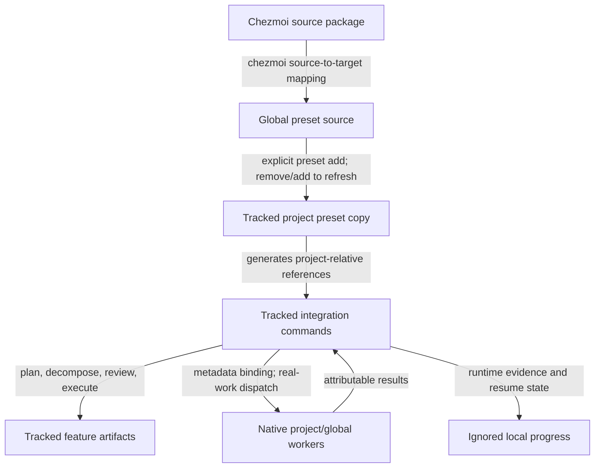

# Timor's Agentic Workflow Architecture

## Overview

`timors-agentic-workflow` is a project-installed Spec Kit preset that connects
grounded planning, optional human review, reviewed execution decomposition,
explicit human approval, and delegated implementation through a versioned
Markdown protocol. The preset is provider-neutral: it defines command and
artifact contracts, while the active coding integration supplies concrete
workers, models, skills, and permissions. Its preset version is `0.3.3` and its
protocol version is `0.1.0`; it supports Spec Kit `>=0.12.11` without an upper
support boundary.

The implemented package and installation behavior have been validated with
Spec Kit 0.12.11 and OpenCode 1.17.18. Runtime review and implementation have
not yet been exercised, so this document describes the implemented contracts
without claiming operational runtime support. This validation is operational
history, not a support boundary.

## Source, Installation, And Activation Boundaries

The editable chezmoi source is:

```text
private_dot_config/specify/presets/timors-agentic-workflow/
```

Chezmoi maps that source to the global preset source at:

```text
~/.config/specify/presets/timors-agentic-workflow/
```

The global source is a distribution source only. Its presence does not activate
the preset in any project, and chezmoi does not install or refresh project
copies automatically.

A project activates the preset explicitly with Spec Kit's development preset
installation. Installation copies the package into the tracked project path
`.specify/presets/timors-agentic-workflow/` and generates tracked command files
for the active coding integration. Generated commands refer to the installed,
project-relative preset path rather than the global source, leaving the project
independent of the dotfiles repository after installation.

For the verified OpenCode integration, those generated files are under
`.opencode/commands/`.

During the non-normative Spec Kit 0.12.11 installation validation, a project
received global source changes through an explicit remove/add refresh, and
`preset resolve` accepted template names only. Command installation was instead
evidenced by generated integration commands and their project-relative
installed-preset references. These observations are operational history, not
future compatibility constraints.


```mermaid
flowchart TD
    source["Chezmoi source package"]
    global["Global preset source"]
    installed["Tracked project preset copy"]
    commands["Tracked integration commands"]
    artifacts["Tracked feature artifacts"]
    runtime["Native project/global workers"]
    progress["Ignored local progress"]

    source -->|"chezmoi source-to-target mapping"| global
    global -->|"explicit preset add; remove/add to refresh"| installed
    installed -->|"generates project-relative references"| commands
    commands -->|"plan, decompose, review, execute"| artifacts
    commands -->|"metadata binding; real-work dispatch"| runtime
    runtime -->|"attributable results"| commands
    commands -->|"runtime evidence and resume state"| progress
```

## Package-Integrity Command Boundary

Every command composed or replaced by the preset begins with the same complete
installed package-integrity gate. It checks the manifest and active `specify`
version, complete required package inventory, declared mappings and strategies,
and preset/protocol identity before extension hooks, prerequisite scripts,
dispatch, or writes. It fails closed only below the minimum, on an explicit
installed-manifest exclusion, or when a required contract is missing, malformed,
or incoherent. Newer untested CLI versions neither warn nor block. This protects
generated commands that remain in a project after the CLI changes without
changing required public integration behavior. The accepted execution-package
protocol is likewise `0.1.0`; unsupported or malformed protocol artifacts return
to their owning generation command rather than being migrated or inferred.

The preset deliberately uses different integration strategies by phase:

- `/speckit.specify` composes with upstream specification generation, retaining
  its behavior and adding optional human review at natural completion;
  `/speckit.clarify` remains upstream and owns product clarification.
- `/speckit.plan` and `plan-template` compose with upstream planning, retaining
  its design artifacts, adding verified grounding and integration context, and
  offering optional human review at natural completion.
- `/speckit.tasks`, `tasks-template`, and `/speckit.implement` replace their
  upstream surfaces because decomposition, independent review, approval, and
  delegated execution share a stronger protocol. The preset provides no
  `/speckit.analyze`; it folds independent review and human approval into
  `/speckit.plan` and `/speckit.tasks`. The stock `/speckit.analyze` resolves from
  a lower layer and is not part of this lifecycle.
- Auxiliary templates provide the indexed sub-plans, cumulative review reports,
  and local progress ledger used by those replacements.

The preset does not run Spec Kit extension hooks. Stock command bodies dispatch
`before_*` and `after_*` hooks from `.specify/extensions.yml`. The preset
replacements omit that mechanism, so no phase runs an extension automatically. The
git extension branch and commit hooks never fire from the workflow. An operator
runs an extension command manually when wanted.

The installed preset references are the normative source for workflow behavior,
artifact schemas, and CLI/package compatibility. The minimum supported version and
the structural package-integrity contract come from the installed manifest and its
`requires.speckit_version`, as described in the Package-Integrity Command Boundary
section above. This architecture overview summarizes those boundaries without
redefining them.

### Optional Human Review

At the natural completion of specification and planning, after artifacts are
generated and validated, each phase independently offers a guided walkthrough
or independent review. Either can be declined. The interaction stores no
preference, approval record, or workflow gate, and does not apply to the
independent review or approval gates.
The installed `human-review.md` reference owns the mechanics: select small,
consequential review units using judgment; pause after each; update and
revalidate current-phase artifacts once a unit is settled; then continue normal
completion reporting and handoffs. Command projections own the phase-specific
conceptual focus, while supporting artifacts remain evidence sources rather
than mandatory walkthrough stops.

## Artifact Ownership

The protocol separates durable planning truth from local runtime evidence:

- `spec.md`, `plan.md`, and the normal design artifacts provide requirements,
  technical design, decisions, data models, contracts, and other planning
  inputs.
- `tasks.md` is the sole atomic task ledger. It owns task identity, task text,
  paths, story labels, task-local parallel hints, and completion checkboxes.
- The indexed `subplans/` own execution groups, the dependency graph and order,
  file ownership, cross-group contracts and data flow, semantic model tiers,
  required skills and capabilities, tests, acceptance criteria, and
  verification.
- `specs/<feature>/reviews/<role-id>.md` files are tracked cumulative sources of
  reviewer findings. Reruns append current-state rounds rather than replacing
  review history.
- The human approval decisions live in their owning artifacts: Design Acceptance
  in `plan.md` and Implementation Authorization in `tasks.md`. The preset produces
  no separate `analysis.md` aggregate.
- `specs/<feature>/progress.md` is an ignored local ledger for concrete workers
  and models, workspaces, dispatch and test evidence, checkpoints, blockers,
  failures, integration state, and resume decisions. It does not duplicate
  atomic task completion truth.

This split keeps provider- and machine-specific details out of tracked planning
artifacts while preserving a reviewable decomposition and approval record.

## Planning And Review Flow

Task generation reads the specification, plan, and available design artifacts,
then creates `tasks.md` and its indexed `subplans/` as one normalized set. It
validates the set before writing, so task descriptions and checkboxes remain in
the task ledger while execution policy remains in the sub-plans.

Independent review runs inside two phases, not a separate command. Each producing
phase dispatches fresh-context, read-only reviewers and blocks its own human
approval until the reviews permit it:

- `/speckit.plan` requires most-capable `rfc-design`, which judges technical
  coherence of the RFC, and mid-tier `rfc-clarity`, which judges cold-reader
  clarity of the RFC. Both feed Design Acceptance in `plan.md`.
- `/speckit.tasks` requires mid-tier `tasks-rfc-fidelity`, which traces the
  accepted RFC and Feature Definition into the task package, and most-capable
  `tasks-executability`, which judges decomposition feasibility and testable
  work. Both feed Implementation Authorization in `tasks.md`.

Before task review, the shared installed structural validator runs first. A
structural failure blocks before reviewer dispatch or report writes. Projects may
select additional project-owned reviewer packets. Each role appends to its
cumulative report under `specs/<feature>/reviews/`, and the producing phase
preserves source finding ownership. No phase performs a fallback self-review, and
no phase produces an `analysis.md` aggregate. Implementation remains blocked until
the latest reviews are complete and the recorded human approval authorizes it.

## Delegated Implementation Flow

Before mutation, implementation repeats the same installed structural
validation and checks report consistency and human authorization. It then
initializes or reconciles local progress and processes only groups made ready by
the approved dependency graph.

For each ready group, the coordinator binds the planned semantic tier, skills,
capabilities, and workspace requirements to an eligible native worker. It
constructs a deterministic packet from the canonical group record, group
details, owned task lines, and checkpointed prerequisite contract outputs. It
does not redesign groups or silently change their dependencies, ownership,
contracts, model tiers, tests, or acceptance criteria.

Policy-permitted parallel groups run in separate worktrees only after every
member of the dispatch set passes readiness and output/cache safety checks.
Completed results are integrated and verified, then retained in signed local
checkpoints before task checkboxes and group state become complete. Dependent
groups consume verified checkpoint outputs rather than uncommitted files. Once
all groups pass final verification, checkpoint history is materialized as one
aggregate dirty review diff while a local checkpoint reference preserves
recovery evidence.

These are implemented command contracts, but their runtime operation has not
yet been exercised through a normal feature.

## Provider-Neutral Runtime Binding

The preset neither provisions workers nor maps provider model IDs to semantic
tiers. Native project or global worker definitions own concrete models, skills,
permissions, invokability, fresh-context support, and workspace targeting;
project-local eligible definitions take precedence. The tracked plan therefore
remains portable across coding integrations, while concrete binding and
dispatch evidence stays in ignored progress or transient runtime state.

Suitability checks inspect runtime metadata and configuration only. Preflight
does not invoke a worker, calibration task, probe, canary, or sacrificial call.
The first worker invocation carries the real assigned review or implementation
work. Missing evidence for tier, concrete model, skills, permissions,
invokability, fresh context or attribution, workspace targeting, dispatch, or
result identity blocks the applicable role or group.

## Failure And Recovery Boundaries

The protocol fails closed at ownership boundaries rather than repairing state
in a later phase:

- Unsupported, missing, or malformed task/execution artifacts are regenerated
  by `/speckit.tasks`; invalid review reports or approval state return to their
  producing phase (`/speckit.plan` or `/speckit.tasks`) with explicit
  confirmation where history could be lost.
- An incomplete review round or a role marked `Recovery required` blocks
  implementation. Ambiguous started invocations are retained for explicit
  recovery and are not automatically redispatched.
- Unsafe worker binding, worktree targeting, dirty state, test evidence,
  integration, checkpoint signing, or prerequisite state blocks the affected
  execution boundary.
- Missing checkpoint, artifact, verification, or attributable result evidence
  cannot be replaced by checked task boxes or optimistic inference.
- Branches, worktrees, checkpoint references, unrelated dirty files, and
  feature artifacts are never automatically stashed, discarded, reset,
  committed, or deleted. Recovery or abandonment requires an explicit human
  disposition.

## Coexistence With Existing Workflows

The existing feature-planning skills, `executing-plans`, and `plan-html` remain
separate and unchanged. The preset adapts compatible guarantees into its own
Spec Kit artifacts and installed references, but it does not invoke those
skills, consume their plan format, or depend on them at runtime.

## Verified Scope

Deterministic validation covers the manifest, structural package inventory,
command and template mappings, optional human-review command/reference
projections, project installation and remove/add refresh, all six template
resolutions, generated OpenCode commands, project-relative preset references,
tracked asset behavior, and targeted chezmoi rendering. These checks do not
invoke generated commands through a model and do not prove semantic runtime
operation. Runtime review, binding, and implementation remain **Not exercised**
until a normal feature completes them with real assigned work.

See the [preset README][preset-readme] for installation and diagnostic commands.
[Artifact contracts][artifact-contracts], [review lifecycle][review-lifecycle],
and [execution lifecycle][execution] define their respective installed protocol
contracts.

[preset-readme]: ../../private_dot_config/specify/presets/timors-agentic-workflow/README.md
[artifact-contracts]: ../../private_dot_config/specify/presets/timors-agentic-workflow/references/artifact-contracts.md
[review-lifecycle]: ../../private_dot_config/specify/presets/timors-agentic-workflow/references/review-lifecycle.md
[execution]: ../../private_dot_config/specify/presets/timors-agentic-workflow/references/execution-lifecycle.md
