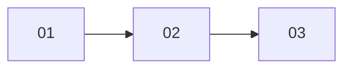

# Master Plan Template

The master plan is the orchestration document. It does NOT contain implementation details — those live in sub-plans.

```markdown
# Master Plan: <Feature Name>

## Summary
<Brief description of what this feature accomplishes>

## Requirements
<Bullet list of confirmed requirements from Phase 1>

## Scope
- **In scope**: ...
- **Out of scope**: ...

## Sub-Plans

| #  | Sub-Plan                | Depends On / Sequenced After | Model  | Description                          |
|----|-------------------------|------------------------------|--------|--------------------------------------|
| 01 | `01-<name>.md`          | —                            | Mid-tier      | <What this sub-plan accomplishes>    |
| 02 | `02-<name>.md`          | 01 (logical dependency)      | Mid-tier      | <What this sub-plan accomplishes>    |
| 03 | `03-<name>.md`          | 02 (policy-only sequencing)  | Mid-tier      | <What this sub-plan accomplishes>    |
...

## Dependency Graph

<Use the same dependency/sequencing edges as the Sub-Plans table. Keep to a portable strict Mermaid-style subset: `flowchart LR` or `flowchart TD`, node IDs as `SP` plus the two-digit sub-plan number, quoted node labels, and one `SPxx --> SPyy` edge per line. Use fork/join edges for parallelizable work; use policy-only edges only when the Concurrency Policy requires serialization.>



## Concurrency Policy

- **Decision**: Linear DAG | Parallel allowed
- **Reason**: <language/build-system/workspace rationale>
- **Linearization basis**: Rust/Cargo | C/C++ build system | Swift/Xcode/SwiftPM | JVM build system | .NET/MSBuild | project-specific constraint | None
- **Execution impact**: <one sub-plan per group, or which groups may run in parallel>
- **Override**: <explicit user-approved/project-documented exception, or None>

## Execution Order
<The execution order must follow the Concurrency Policy and form a valid DAG. If the decision is Linear DAG, use one sub-plan per sequential group even when later work is only policy-sequenced. If the decision is Parallel allowed, sub-plans in the same parallel group cannot depend on each other. Every dependency edge points from an earlier group to a later one. Sub-plans cannot communicate at runtime — the lead relays results strictly along dependency edges.>
- **Sequential group 1**: 01
- **Sequential group 2**: 02 (after 01; logical dependency)
- **Sequential group 3**: 03 (after 02; policy-only sequencing)
...

## Execution via Worker Agents

**Worker agents are REQUIRED for plans with 2+ sub-plans.** Each sub-plan's model + skills combination maps to a worker agent definition or dispatch recipe created during planning. Worker agents are the only reliable mechanism for controlling sub-agent model selection; model requests via natural language prompts or team configuration are unreliable.

**The only exception** — skip worker agents when:
- Single sub-plan (just execute directly)
- All sub-plans are trivially small (e.g., "add one import")

**Worker Agents**:
| Sub-Plan | Implementer Worker | Test Author Worker | Model Tier |
|----------|-------------------|-------------------|------------|
| 01       | `<tier>-<domain>-worker` | `<tier>-test-author-worker` | <tier> |
| 02       | `<tier>-<domain>-worker` | `<tier>-test-author-worker` | <tier> |
| 03       | `<tier>-<domain>-worker` | — (no testable AC) | <tier> |
...

**File Ownership** (prevent conflicts during worktree integration):
| Sub-Plan | Primary Files |
|----------|---------------|
| 01       | <files this sub-plan creates/modifies> |
| 02       | <files this sub-plan creates/modifies> |
...

**Build/Cache Seeding** (for isolated worktrees):
<Use "None" when no ignored in-repository build/cache artifacts need seeding. For a Linear DAG, list only caches required for isolated TDD or explicitly approved isolated execution. For Parallel allowed plans, list relative directories that isolated TDD and implementer worktrees need available before dispatch. Cache seeding does not override the Concurrency Policy. The execution skill owns the seeding mechanics.>

| Relative Path | Applies To | Purpose | Notes |
|---------------|------------|---------|-------|
| `<cache-dir>/` | <sub-plans> | <build/test cache purpose> | <seed before dispatch, or not required> |
...

## Cross-Sub-Plan Data Flow
<Trace every data path that crosses sub-plan boundaries. Each row is one piece of data that is produced in one sub-plan and consumed in another.>

| Data | Source (Sub-Plan) | Transport | Destination (Sub-Plan) |
|------|-------------------|-----------|------------------------|
| <what> | 01 — `producer.Method()` | <how it travels: config field, return value, file, event, etc.> | 02 — `consumer.Method()` |
...

<If a hop has no sub-plan owner, it's a gap — assign it or flag it.>

**Lead Agent Instructions**:
- Use this master plan as the roadmap
- Before editing implementation files, initialize or resume `progress.md` and fill the execution audit with planned workers, model tiers, dispatch mechanisms, implementation workspace, build/cache seeding status, integration status, and TDD gate status
- Spawn each sub-plan's assigned worker agent from the table above using the active runtime adapter's dispatch mechanism. Do not self-execute assigned worker tasks in the coordinator context
- Follow the Concurrency Policy. If the decision is Linear DAG, run one sub-plan at a time even when no logical dependency exists
- Run sub-plans in the same parallel group concurrently only when the Concurrency Policy allows it and only through task-scoped implementer worktrees where the runtime supports isolated dispatch and file ownership does not conflict. If isolation or output/cache safety cannot be verified, serialize the group or ask the user
- Use the Build/Cache Seeding table as the source of cache directories for isolated TDD or implementer worktrees. Follow `executing-plans` for seeding mechanics, verification, and progress recording. Cache seeding does not permit parallel execution when the Concurrency Policy says Linear DAG
- For sequential dependencies, wait for the prior worker to complete before spawning the next
- The lead relays information between workers when needed (workers cannot communicate directly)
- Keep plan files, review files, and `progress.md` in the coordinator workspace. Do not copy them into worker worktrees
- Pass each implementer an inline sub-plan task packet plus prerequisite context. Do not rely on sub-plan file paths inside worker worktrees
- For test-author workers, pass only acceptance criteria and code-surface context through an isolated workspace; do not pass plan paths, feature names, or design rationale. When a task has an implementer worktree, use that worktree for test authoring and then implementation. Same-workspace subagent invocation is not enough for structural TDD unless the runtime can prove it routes the worker into the isolated workspace
- Follow `executing-plans` for task worktree integration and final review materialization. Record merge conflicts, integration failures, or regressions in `progress.md`
- If a worker binding, model assignment, implementer worktree, or TDD isolation mechanism cannot be used, diagnose and retry once. If it still cannot be used, stop and ask the user rather than falling back to coordinator execution, shared-workspace parallelism, or a different model tier
- Synthesize results when all sub-plans finish

**Coordination Points**:
<When the lead needs to relay information between sequential workers>
- After 01 completes: Pass results to worker executing 02
- If <event>: Relay to affected workers
...

## Risks & Mitigations
| Risk | Mitigation |
|------|------------|
| ...  | ...        |

## Post-Execution
If this project has component-level documentation, run the `component-docs-reviewer` agent to verify
component docs still match the actual implementation.
```
