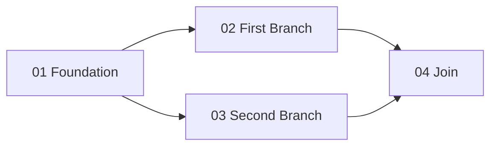

# Decomposition

Use this reference when decomposing RFC scope into executable sub-plans or defining cross-sub-plan contracts.

## Boundary Selection

Break work along natural seams: layers, domains, files, modules, independently verifiable outcomes, or integration boundaries.

Each sub-plan should be small enough for one focused execution session. If it feels too large, split it further.

Preserve RFC non-goals by keeping excluded work out of the plan. Do not automatically restate every non-goal in downstream sub-plans. If implementation pressure suggests a non-goal should change, stop and ask whether to revise the RFC or approve an explicit deviation.

Translate RFC risks into plan mechanics: constraints, acceptance criteria, sequencing notes, rollback notes, or handoff constraints.

## Dependency DAG

Minimize dependencies and make each edge explicit and one-directional. The dependency graph must form a valid DAG.

Before placing independent sub-plans in the same execution group, apply [concurrency-policy.md](concurrency-policy.md). For restricted build ecosystems, keep the DAG linear even when sub-plans are logically independent.

- No sub-plan may depend on information produced by a later sub-plan.
- No sub-plan may depend on information produced by a sub-plan in the same parallel group.
- Sub-plans cannot communicate at runtime; the lead agent relays results strictly along dependency edges.
- If decomposition requires bidirectional information flow, merge or restructure the boundaries.
- Same-group placement means logical independence only; the master plan must still record that parallel execution is allowed by policy, require isolated implementer worktrees for concurrent execution, or explicitly serialize the group.
- Linear policy sequencing is allowed for operational safety. Label policy-only sequencing separately from real data-flow dependencies in the master plan.

The master plan must include both representations of this same DAG:

- `## Sub-Plans` table: canonical metadata plus dependency/sequencing text in `Depends On / Sequenced After`.
- `## Dependency Graph`: portable strict Mermaid-style graph block that makes the same DAG visible in markdown and compatible with downstream tooling.

Keep them consistent. If `03` depends on `01`, the table says `01` and the graph contains `SP01 --> SP03`. If `04` joins two branches, the table says `02, 03` and the graph contains both `SP02 --> SP04` and `SP03 --> SP04`.

Use only this graph subset:

## Embedded RFC Context

Each sub-plan must be self-contained. Include only execution-critical context:

- RFC decisions, constraints, goals, non-goals, and risks that govern this unit
- domain knowledge the agent cannot derive from code, such as business rules, config formats, protocol details, or accepted tradeoffs
- exact cross-boundary contracts that other sub-plans depend on
- prerequisites, primary files, acceptance criteria, required skills, and execution model

Apply the cold-reader test to every included statement: a reader who knows only this sub-plan and its referenced sources should understand why the statement affects execution. Include a negative constraint only when the assigned scope or visible codebase makes the competing behavior plausible, and name that concrete behavior or risk. Omit conversational history, rejected alternatives, and unrelated RFC non-goals; fidelity does not require repeating exclusions that the plan already preserves by omission.

Do not include method bodies, private helper design, step-by-step coding instructions, exact test/lint/build commands, or design decisions already owned by skills.

Skills are the agent's authority for how to write code, test, lint, build, and document. The plan defines what to build and why. List required skills, but do not replicate their content.

## Cross-Boundary Contracts

When sub-plans run in parallel, consuming agents cannot discover producer output at execution time. The plan must specify the contract: interface/type signatures, files, data shapes, commands, or artifacts.

For sequential dependencies, the later agent can read the earlier sub-plan's actual output. A pre-specified contract is still required when the earlier output constrains later work.

Contracts must satisfy these integrity rules:

- **Caller annotations**: every new public method/function introduced by a sub-plan must specify its production caller. If the caller lives in a different sub-plan, both sides reference the contract.
- **Connected data flow**: every cross-sub-plan data path must trace source -> transport mechanism -> destination, with sub-plan ownership at each hop.
- **Interface boundary checks**: if a sub-plan adds a method to a concrete type, but consumers access that type through an interface, the plan must either add the method to the interface or assign concrete-type wiring to a specific sub-plan.

No orphan public methods. No prose-only data flow such as "X stores the value on config" when the consumer needs it delivered through a channel no sub-plan owns.

## Decisiveness

Before writing a design decision, verify it against the RFC and codebase.

Do not write hedges like `if X exists` or `either A or B`. Pick the RFC-approved approach or stop for clarification.

## Documentation Sub-Plan Trigger

If the feature affects documented domain concepts, architecture, or business processes, add a final documentation sub-plan. Use [documentation-sub-plan.md](documentation-sub-plan.md).

Skip documentation planning only when the feature does not affect documented concepts, flows, or architecture; the only doc impact is component-level post-execution drift review; or no project documentation exists yet.
