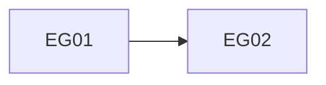

# Execution Plan: [FEATURE NAME]

**Preset Protocol Version**: 0.1.0

## Summary

[Describe the feature outcome and decomposition for a cold reader.]

## Planning Inputs

| Artifact | Path | Required |
|----------|------|----------|
| Specification | specs/[###-feature-name]/spec.md | Yes |
| Implementation Plan | specs/[###-feature-name]/plan.md | Yes |
| Tasks | specs/[###-feature-name]/tasks.md | Yes |

## Execution Groups

| ID | Group | Covers | Depends On / Sequenced After | Model | Description |
|----|-------|--------|--------------------------------|-------|-------------|
| EG01 | [Foundation group name] | T001 | None | Mid-tier | [Distinct foundation outcome] |
| EG02 | [Story group name] | T002 | EG01 (logical dependency) | Mid-tier | [Distinct story outcome] |

## Dependency Graph

## Concurrency Policy

- **Decision**: Linear DAG | Parallel allowed
- **Reason**: <verified build/workspace rationale>
- **Linearization basis**: Rust/Cargo | C/C++ build system | Swift/Xcode/SwiftPM | JVM build system | .NET/MSBuild | project-specific constraint | None
- **Execution impact**: <permitted schedule>
- **Override**: <approved exception or None>

## Execution Order

- **Sequential group 1**: EG01
  - **After**: None

- **Sequential group 2**: EG02
  - **After**: EG01 (logical dependency)

## File Ownership

| Group | Primary Files |
|-------|---------------|
| EG01 | [foundation/project-relative/path] |
| EG02 | [story/project-relative/path] |

## Build/Cache Seeding

| Relative Path | Applies To | Purpose | Notes |
|---------------|------------|---------|-------|
| [project-relative/cache-path] | EG01, EG02 | [Build or test cache purpose] | [Seeding requirement or safe no-seed disposition] |

## Cross-Group Data Flow

| Flow ID | Data | Source Group | Producer Contract | Transport | Destination Group | Consumer Contract |
|---------|------|--------------|-------------------|-----------|-------------------|-------------------|
| DF01 | [Transferred data] | EG01 | CT01 | [File, value, interface, or other transport] | EG02 | CT02 |

## Execution Risks

| Risk | Impact | Mitigation / Acceptance |
|------|--------|-------------------------|
| [Concrete execution risk] | [Potential effect] | [Mitigation or explicit acceptance] |

## Project Review Roles

| Role ID | Packet Path | Model Tier | Applicability Rationale |
|---------|-------------|------------|-------------------------|
| None |  |  |  |

## Execution Group Details

### EG01: [Foundation group name]

#### Objective

[One independently verifiable execution outcome.]

#### Required Skills

- [exact-skill-id]

#### Required Capabilities

- read
- edit

#### Execution Model

[Provider-neutral rationale for the semantic tier selected in Execution Groups.]

#### Prerequisites

None

#### Context

[Feature facts, constraints, and evidence needed by this group.]

#### Primary Files

[foundation/project-relative/path]

#### Integration Contracts

**Produces**

| Contract ID | Flow IDs | Shape / Artifact | Consumers |
|-------------|----------|------------------|-----------|
| CT01 | DF01 | [Exact shape or artifact string] | EG02 |

**Consumes**

| Contract ID | Flow IDs | Source | Expected Shape / Artifact |
|-------------|----------|--------|---------------------------|

**Interface Wiring**

| Contract ID | Interface / Boundary | Owner | Wiring |
|-------------|----------------------|-------|--------|
| CT01 | [Interface or boundary] | EG01 | [Concrete wiring responsibility] |

#### Design Decisions

None

#### Test Expectation

[Tests required | Existing coverage: evidence expected | Not applicable: reason]

#### Acceptance Criteria

- [Observable behavior or artifact outcome]

#### Verification

- [Command, inspection, or scenario that proves the acceptance criterion]

### EG02: [Story group name]

#### Objective

[One independently verifiable story outcome.]

#### Required Skills

- [exact-skill-id]

#### Required Capabilities

- read
- edit

#### Execution Model

[Provider-neutral rationale for the semantic tier selected in Execution Groups.]

#### Prerequisites

[Foundation outcome from EG01 available through CT01 and DF01.]

#### Context

[Story facts, constraints, and evidence needed by this group.]

#### Primary Files

[story/project-relative/path]

#### Integration Contracts

**Produces**

| Contract ID | Flow IDs | Shape / Artifact | Consumers |
|-------------|----------|------------------|-----------|

**Consumes**

| Contract ID | Flow IDs | Source | Expected Shape / Artifact |
|-------------|----------|--------|---------------------------|
| CT02 | DF01 | EG01 | [Exact shape or artifact string] |

**Interface Wiring**

None

#### Design Decisions

None

#### Test Expectation

Tests required

#### Acceptance Criteria

- [Observable behavior or artifact outcome]

#### Verification

- [Command, inspection, or scenario that proves the acceptance criterion]

<!-- Repeat one detail section per execution-group row. Use Integration
Contracts: None when a group has no cross-group contract. Use Interface Wiring:
None when contracts exist but no wiring applies. Remove placeholder flow and
contract rows that do not correspond to an exact master-table join. -->

## Post-Execution

[State final integrated verification and applicable documentation review.]
