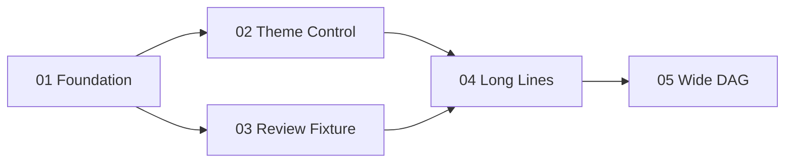

# Master Plan: Plan HTML Demo

## Summary

Demonstrate the full plan-html review dashboard, including the plan-level objective,
execution graph, sub-plan cards, theme controls, and reference material.

## RFC Baseline

- **RFC Status**: Accepted

## Explicit Deviations

None

## Sub-Plans

| # | Sub-Plan | Depends On / Sequenced After | Model | Description |
|---|----------|------------------------------|-------|-------------|
| 01 | `01-foundation.md` | - | Mid-tier | Extract source assets and preserve self-contained output |
| 02 | `02-theme-control.md` | 01 | Cheapest | Add System / Light / Dark controls with no persistence |
| 03 | `03-review-fixture.md` | 01 | Mid-tier | Add stable fixture coverage and manual smoke checks |
| 04 | `04-long-lines.md` | 02, 03 | Cheapest | Exercise long unbroken inline code and commands inside cards |
| 05 | `05-wide-dag.md` | 04 | Mid-tier | Confirm the dashboard remains readable with more than three DAG nodes |

## Dependency Graph

## Review Summary

| Reviewer | Status |
|----------|--------|
| plan-clarity-reviewer | Passed |
| plan-executability-reviewer | Passed with concerns |

## Manual Smoke Checks

- Open the generated HTML in a browser.
- Switch between System, Light, and Dark.
- Expand and collapse all cards.
- Click each DAG node and confirm it opens the matching sub-plan.
- Confirm all five DAG nodes stay readable when the browser is narrowed.
- Confirm the reference review section remains readable.
